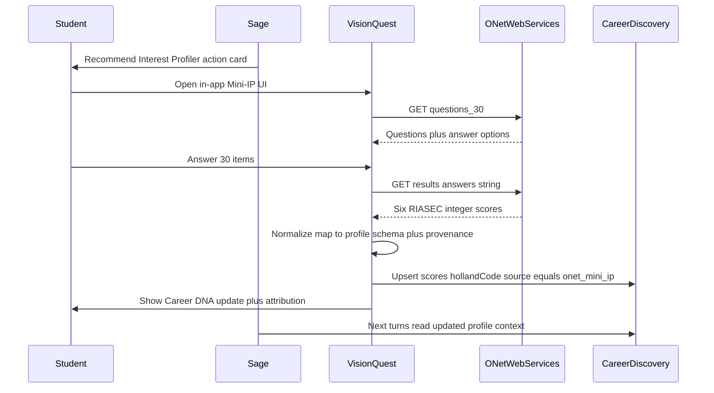
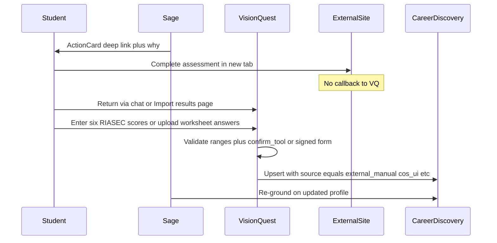

# Assessment Round-Trip Feasibility Research

**Date:** 2026-07-24  
**Status:** Research complete — no implementation  
**Primary case:** Interest Profiler / RIASEC (CareerOneStop example from captured todo)  
**Related todo:** [`.planning/todos/pending/2026-07-24-seamless-external-assessment-round-trips.md`](../todos/pending/2026-07-24-seamless-external-assessment-round-trips.md)

---

## 1. Executive verdict

**Making “Sage recommends an assessment → student completes it → VisionQuest/Sage adapt” possible is feasible.** The right technical surface for Interest Profiler results is **not** CareerOneStop’s consumer Interest Assessment page.

| Rank | Path | Verdict |
|------|------|---------|
| **1** | **Path A — Native Mini-IP via O\*NET Web Services** | **Recommended.** Free developer signup, REST API for questions + RIASEC results + matching careers, designed for in-app UX. Fits existing `CareerDiscovery.hollandCode` / `riasecScores` sink once score-scale + provenance gaps are fixed. |
| **2** | **Path B — External leave + guided return** | **Feasible as a general pattern** for partners with no callback (CareerOneStop Interest Assessment, My Next Move web IP, WorkKeys, paper worksheets). Requires explicit return UX (paste scores / guided form); no automatic callback exists. |
| **3** | **Deep-link only (ActionCard → external site)** | **Already half-built** (`ActionCard` opens `https://…` in a new tab). **Incomplete as a product** — nothing writes results back; Sage cannot adapt. |
| **Not feasible** | **iframe / seamless embedded CareerOneStop or My Next Move UI with silent return** | Consumer pages are not partner integration surfaces. No documented return URL / postMessage contract. Iframe embedding is blocked or unreliable on government career sites (research HEAD requests were blocked with HTTP 403 from this environment; industry-standard `X-Frame-Options` / CSP on DOL properties makes silent embed unsafe to plan around). **Scraping those UIs is out of scope and inappropriate** (ToS, reCAPTCHA, gov site). |

**Naming trap (must stay in Sage prompts/tools):**

- **CareerOneStop Interest Assessment** = consumer UI “Powered by O\*NET® Interest Profiler™” at CareerOneStop — **no results API / return handshake**.
- **CareerOneStop Skills Matcher** = separate COS Web API (`/v1/skillsmatcher/...`) — **already wrapped** in VisionQuest and exposed to Sage as `career_skills_match`. Skills ratings ≠ Interest Profiler.
- **O\*NET Interest Profiler (Mini-IP / Short Form)** = the instrument; **O\*NET Web Services** is how apps host and score it.

**Bottom line for Britt:** Prefer Path A for Interest Profiler. Keep Path B as the reusable pattern when Sage must send students off-site (WorkKeys, CFWV worksheets, brand-familiar CareerOneStop links). Do not treat CareerOneStop Interest Assessment as an integration API.

---

## 2. Partner capability matrix

| Partner / surface | Deep-link | Callback / return API | Result schema | Auth | ToS / attribution | WV / SPOKES fit |
|-------------------|-----------|----------------------|---------------|------|-------------------|-----------------|
| **CareerOneStop Interest Assessment** (consumer UI) | Yes — `https://www.careeronestop.org/Toolkit/Careers/interest-assessment.aspx` | **No** documented partner return URL, webhook, or result export API | Human-readable RIASEC / career list in browser only | Public web (bot/CAPTCHA protections) | DOL/COS site ToS; powered by O\*NET IP | High brand familiarity for workforce students; poor for automated profile update |
| **My Next Move Interest Profiler** (consumer UI) | Yes — `https://www.mynextmove.org/explore/ip` (and results can encode `answers=` for shareable result URLs) | **No** callback to third-party apps; student stays on My Next Move | Same instrument; results page is consumer-facing | Public web | CC licenses on tools; trademark rules for “O\*NET®” | Excellent instrument pedigree; still Path B for return |
| **O\*NET Web Services — Mini-IP (30q)** | N/A (host UI yourself) | **Yes — first-class:** `GET …/mnm/interestprofiler/questions_30`, `…/results?answers=…`, `…/careers?answers=…` (or RIASEC score params) | JSON: six interest areas with **integer** `score`, titles, descriptions; careers with fit | Free developer account; server-side Basic auth (or client CORS project) | Career Exploration Tools: **CC BY-ND 4.0** (verbatim) or **O\*NET Tools Developer License** (modify/extend + validate). Trademark: “O\*NET®” as adjective. Optional developer registration. Web Services docs also CC BY 4.0. | **Best fit for Path A** |
| **O\*NET Web Services — IP Short Form (60q)** | N/A | Same pattern (`…/questions` + results) | Same RIASEC result shape; longer assessment | Same | Same | Prefer when accuracy > session length |
| **O\*NET embeddable widget** | Embed snippet after signup | Widget launches IP experience; **does not** by itself write into VQ DB | Consumer scoring inside widget | Developer program | Same tool licenses + attribution | Good “start here” UX; still need Path A API or Path B import for profile write |
| **CareerOneStop Skills Matcher** (API) | N/A — already in chat | In-process via COS API (questions GET + submit POST) | Skill ratings → matched occupations (not Holland IP) | `COS_USER_ID` + `COS_API_TOKEN` (already in repo) | COS API terms | **Already live** via `career_skills_match` — do not confuse with Interest Profiler |
| **ACT WorkKeys / NCRC** | External ACT / Essential Education platforms | No VisionQuest callback today | Certificate / level outcomes (not RIASEC) | Student accounts on vendor platforms | ACT vendor ToS | High SPOKES relevance; Path B / portfolio cert ingest pattern, separate from IP |
| **CFWV Career Exploration Worksheet** | Open PDF resource (RAG/catalog candidate) | Manual / instructor | Worksheet answers — unstructured | N/A | Program materials | Path B lite: open_resource + later structured capture if desired |

### O\*NET Interest Profiler API — verified shape (v2)

- **Base:** `https://api-v2.onetcenter.org/mnm/interestprofiler/…`
- **Questions (Mini-IP):** `questions_30` — 30 work-activity items; answer options 1–5 (Strongly Dislike → Strongly Like); pagination via `start`/`end`.
- **Answers parameter:** ordered digit string of responses (docs describe building the answers string for Results / Matching careers; Short Form is 60 items; Mini-IP uses the 30-question list — implementers must follow the Questions doc for the exact string length for the version chosen).
- **Results:** `results?answers=…` → six RIASEC entries with integer `score` (example magnitudes ~teens–thirties in docs, **not** 0–1 floats).
- **Matching careers:** `careers?answers=…` **or** six named score query params (`realistic=…&investigative=…` …).
- **Spanish:** parallel `/mpp/…` Mi Próximo Paso services.

### CareerOneStop API — what VisionQuest already uses

Documented in-repo ([`src/lib/career/careeronestop-counseling.ts`](../../src/lib/career/careeronestop-counseling.ts)): Skills Matcher, occupation search/profiles, wages, tools & technology, training — **no Interest Profiler / Interest Assessment endpoint** in that client. Job search adapter separately uses COS job APIs. Confirmed against public API explorer orientation: COS is a data/API product; the Interest Assessment **page** is not exposed as that product’s “return results to partner” flow.

---

## 3. VisionQuest gap analysis

### What already works

| Capability | Evidence |
|------------|----------|
| Profile sink for RIASEC | `CareerDiscovery.hollandCode`, `riasecScores` (JSON text) — [`prisma/schema.prisma`](../../prisma/schema.prisma) |
| Student-facing Career DNA | [`src/lib/career-profile.ts`](../../src/lib/career-profile.ts), [`src/components/career/CareerProfile.tsx`](../../src/components/career/CareerProfile.tsx) — assumes scores **0..1**, displays percent |
| Sage chat grounding | [`src/lib/chat/context.ts`](../../src/lib/chat/context.ts) injects Holland + RIASEC into system context |
| Job match uses Holland | [`src/lib/job-board/recommendation.ts`](../../src/lib/job-board/recommendation.ts) (~20% weight), banded matching |
| Teacher visibility | `GET /api/teacher/students/[id]` + OverviewTab Career Discovery Summary + staff Sage context |
| Outbound external links | [`ActionCard`](../../src/components/chat/ActionCard.tsx): `https://` → new tab (`noopener`) |
| Verified write-back pattern | `confirm_tool` + HMAC → [`/api/chat/tool-confirm`](../../src/app/api/chat/tool-confirm) — reuse for “commit imported assessment” |
| COS credential pattern | Lazy `process.env` `COS_USER_ID` / `COS_API_TOKEN` in [`careeronestop-config.ts`](../../src/lib/career/careeronestop-config.ts); degrade when absent |
| Conversational Skills Matcher | `career_skills_match` in [`career-grounding-tools.ts`](../../src/lib/sage/agent/career-grounding-tools.ts) |

### How scores are written today (critical)

Exactly **two** paths write `hollandCode` / `riasecScores`:

1. **Sage discovery extractor** ([`discovery-extractor.ts`](../../src/lib/sage/discovery-extractor.ts)) — LLM infers RIASEC **0.0–1.0** from conversation; Holland code derived server-side from top dimensions.
2. **Post-response upsert** ([`post-response.ts`](../../src/lib/chat/post-response.ts)) — when `conversationStage === "discovery"`, upserts `CareerDiscovery` (complete or in_progress). **Last-write-wins; no merge; no history.**

Teacher `PATCH …/discovery` only marks `status: "complete"` — **does not** set scores; audit log notes absence of source column by design.

**There is no student/teacher form or API to enter Interest Profiler results.**

### Gaps to close before either path ships

| Gap | Why it blocks |
|-----|----------------|
| **No O\*NET client / env** | No `ONET_*` (or similar) in [`env.ts`](../../src/lib/env.ts); no Web Services calls in repo |
| **Score-scale mismatch** | O\*NET Results = **integers**; VQ pipeline = **0..1 floats**. Blind write would break Career DNA % and confuse consumers unless normalized (e.g. store canonical O\*NET integers + display scale, or map with documented formula) |
| **No provenance / source** | `CareerDiscovery` has no `source`, `assessmentInstrument`, `consentAt`, or version history. Imported IP scores are indistinguishable from LLM guesses; a later discovery turn **silently overwrites** them |
| **No outbound “start assessment” product flow** | Action kinds are `navigate \| open_form \| open_resource \| highlight \| confirm_tool`. External https works, but **no tool emits** Interest Profiler links today; no “I’ve finished” return card |
| **No click / completion telemetry** | ActionCard does not notify server when student opens a link |
| **Consent / FERPA process** | Assessment results are student education records when stored. No consent capture on model; teachers already see full discovery payload — policy must cover instrumented assessments |
| **Attribution UI** | O\*NET license requires credit + trademark-safe wording if hosting IP content |
| **Conflict policy** | Undefined: Sage chat extraction vs formal Mini-IP vs teacher override vs re-take |

### ActionCard implications

- **Start (outbound):** can use `navigate` or `open_resource` with `https://…` **or** prefer in-app route for Path A (`/career/interest-profiler`).
- **Return (write):** do **not** rely on bare links. Use **`confirm_tool`** (or a dedicated authenticated POST) so import/normalization is server-verified before mutating `CareerDiscovery`.

---

## 4. Recommended architecture sketch (research-level)

### Path A — Native Mini-IP (preferred for Interest Profiler)

**Build pieces (later implementation, not this research):** O\*NET server client; env secrets; Mini-IP UI; normalize + provenance fields; protect discovery extractor from clobbering `source=onet_*` without policy; Sage tool/prompt to recommend `/career/interest-profiler`; CC attribution footer.

### Path B — External partner + guided return (CareerOneStop / My Next Move / WorkKeys-class)

**Build pieces:** Allowlisted outbound URLs; “Import Interest Profiler results” form (six scores + optional Holland); optional photo/PDF **manual review** (OCR is Later); `confirm_tool` or dedicated API; same provenance + clobber rules as Path A.

### Shared edge cases (process)

| Case | Proposed process stance |
|------|-------------------------|
| Incomplete attempt | Leave `CareerDiscovery` unchanged; Path A draft answers stay client-side or ephemeral until submit |
| Re-take | New submission supersedes prior **formal** assessment of same instrument; keep audit/history if provenance table added |
| Conflicting sources | Formal instrument (`onet_mini_ip`) beats LLM extraction; teacher override remains audit-logged; prompt Sage not to re-extract over locked formal scores |
| Student declines | ActionCard Skip stays client-local; no profile write |
| Unconfigured O\*NET key | Degrade like COS: Sage explains assessment unavailable or offers Path B deep-link + manual import |
| Attribution | Always show O\*NET credit on Path A UI and anywhere IP content is shown |
| Teacher view | Continue showing scores; surface **source + completedAt** once provenance exists |

---

## 5. Requirements backlog

### Must (to make Interest Profiler round-trip real)

- Register O\*NET Web Services developer project; store credentials server-side only (mirror COS lazy-env pattern).
- Implement Path A Mini-IP **or** Path B import form (product decision — see §6); both need a **single write API** into `CareerDiscovery` with validation.
- Add **provenance** (`source`, `instrument`, `assessedAt` at minimum) so formal scores are not clobbered by discovery extraction.
- Define **score canonicalization** (store O\*NET integers vs 0–1; document conversion for Career DNA / job match).
- Sage: stop recommending “CareerOneStop Interest Assessment” as if results auto-return; recommend Path A route or Path B + import.
- O\*NET **attribution + trademark** copy on student-facing IP UI.
- FERPA/consent note: store only after student completes/submits; teachers already see discovery — confirm with Britt that formal IP is same visibility class.

### Should

- Audit log on every formal assessment write (parallel to `teacher.student.discovery_override`).
- `confirm_tool` (or equivalent) for Path B imports.
- Matching-careers call after results to enrich coaching (optional cache of top O\*NET-SOC fits).
- Prompt/tool guardrails distinguishing Skills Matcher vs Interest Profiler.
- Spanish Mini-IP (`/mpp/…`) if program needs it.
- Session UX: resume incomplete Path A attempts.

### Later

- Full 60-question Short Form.
- O\*NET embeddable widget as entry point (still Path A API or Path B for persistence).
- OCR / screenshot import of external result pages.
- General **AssessmentRoundTrip** framework for WorkKeys, CFWV, etc.
- Version history table for score changes.
- Click telemetry on outbound ActionCards.
- Expanded O\*NET IP filtering API (docs note H1 2026 expansion).

### Explicitly out / reject

- Scraping CareerOneStop or My Next Move.
- Planning on silent iframe→postMessage from those sites without a published partner contract.
- Treating COS Skills Matcher as a substitute for Interest Profiler.

---

## 5b. Audit / instructor evidence implications (added 2026-07-24)

Britt needs assessment results (and eventually all student progress + forms + portfolio) available for **unscheduled audits** — ideally one button for instructor/admin. Captured as a later todo:

→ [`.planning/todos/pending/2026-07-24-one-button-student-audit-evidence-pack.md`](../todos/pending/2026-07-24-one-button-student-audit-evidence-pack.md)

**How this changes Interest Profiler storage design (even if audit pack ships later):**

| Live coaching field | Audit-stable record (required thinking) |
|---------------------|----------------------------------------|
| `CareerDiscovery.riasecScores` / `hollandCode` (mutable, last-write-wins) | Versioned snapshot: instrument id, source (`onet_mini_ip` / `manual_entry`), scores as recorded, `assessedAt`, who confirmed, optional printable score report |
| Chat-inferred discovery | **Not** auditor evidence unless explicitly labeled informal |
| Teacher “mark complete” | Already audit-logged; formal IP submit should similarly write `AuditLog` |

Do **not** treat Career DNA alone as the official record. Path A/B writes should produce something an audit pack can reprint years later (same idea as numbered program forms).

**Sequencing recommendation:** Do **not** block Mini-IP on building the full one-button audit pack. Do **research the auditor checklist soon** (form numbers, required artifacts) so IP schema includes snapshot/provenance fields from day one. Building the entire audit-pack product *first* is only warranted if an audit is imminent and staff have no workable export path; otherwise: **IP with audit-stable storage → audit-pack research → one-button pack**.

Existing partial exports to inventory in that research: `src/app/api/teacher/export/route.ts` (CSV), `src/lib/forms/export.ts`, grant KPI CSVs, portfolio on student detail.

## 6. Open decisions for Britt

1. **Primary Interest Profiler delivery:** Path A (native Mini-IP in VisionQuest) vs Path B-first (send students to CareerOneStop/My Next Move for familiarity, then guided import)? Research recommends **Path A**; Path B remains for other partners and as fallback.
2. **Score storage:** Keep Career DNA on 0–1 and normalize O\*NET integers on write, **or** migrate stored RIASEC to O\*NET integer scale and update all readers?
3. **Clobber policy:** When `source` is a formal instrument, should discovery-stage LLM extraction be **blocked**, **merge-only-empty-fields**, or **always subordinate**?
4. **Teacher / student consent:** Is completing Mini-IP implied consent to store + show staff, or is an explicit checkbox required?
5. **Scope of v1:** Interest Profiler only, or also a thin Path B import shell reused later for WorkKeys?
6. **Brand copy:** When linking externally, prefer “CareerOneStop Interest Assessment” (familiar) vs “O\*NET Interest Profiler on My Next Move” (accurate instrument name)?
7. **Audit timing:** Is an unscheduled audit imminent enough to prioritize audit-pack **research** before IP build, or is “IP with snapshot/provenance fields now + audit pack later” acceptable?

---

## 7. Sources

### Official / external

- O\*NET Interest Profiler Services — https://services.onetcenter.org/ip  
- O\*NET Resource Center — Interest Profiler — https://www.onetcenter.org/IP.html  
- Career Exploration Tools licenses — https://www.onetcenter.org/license_tools.html  
- O\*NET Web Services help — https://www.onetonline.org/help/onet/webservices  
- Reference: Mini-IP Questions — https://services.onetcenter.org/reference/mnm/ip/ip_questions_30  
- Reference: Results — https://services.onetcenter.org/reference/mnm/ip/ip_results  
- Reference: Matching careers — https://services.onetcenter.org/reference/mnm/ip/ip_careers  
- CareerOneStop Interest Assessment (consumer) — https://www.careeronestop.org/Toolkit/Careers/interest-assessment.aspx  
- CareerOneStop API Explorer — https://api.careeronestop.org/api-explorer/  
- My Next Move Interest Profiler — https://www.mynextmove.org/explore/ip  

### VisionQuest (repo)

- Todo: `.planning/todos/pending/2026-07-24-seamless-external-assessment-round-trips.md`
- Schema: `prisma/schema.prisma` — `CareerDiscovery`
- Writes: `src/lib/sage/discovery-extractor.ts`, `src/lib/chat/post-response.ts`, `src/app/api/teacher/students/[id]/discovery/route.ts`
- Reads: `src/lib/career-profile.ts`, `src/lib/career-discovery.ts`, `src/lib/chat/context.ts`, `src/lib/job-board/recommendation.ts`, `src/lib/sage/staff-student-context.ts`
- COS: `src/lib/career/careeronestop-config.ts`, `src/lib/career/careeronestop-counseling.ts`
- Sage tools: `src/lib/sage/agent/career-grounding-tools.ts` (`career_skills_match`)
- Actions: `src/components/chat/ActionCard.tsx`, `src/lib/chat/sse.ts`, `confirm_tool` / `/api/chat/tool-confirm`
- Adjacent inventory: `.planning/career-grounding/phase-a-inventory.md` (CFWV worksheet, WorkKeys docs)

### Method notes

- Research-only; no feature code, no secrets committed, no scraping.
- Consumer-site HEAD checks from this environment returned HTTP 403 (bot protection); iframe blocking treated as expected risk, not lab-proven header dump.
- COS Interest Assessment page content confirms “Powered by O\*NET® Interest Profiler™” — consumer wrapper, not VQ’s integration surface.
