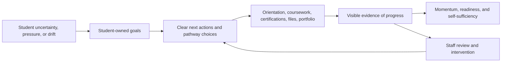

# VisionQuest Product Guide

Status: Active  
Effective window: March 23, 2026 through June 21, 2026  
Audience: AI agents, coding agents, and development contributors

This is the single product reference for VisionQuest. It consolidates the mission, charter, and current gap assessment. Agents working on product-shaping changes should read this before starting.

For scope and framework decisions, see [PRODUCT_DECISIONS.md](./PRODUCT_DECISIONS.md).  
For repo-specific operating rules, see [CLAUDE.md](../CLAUDE.md).  
For academic effectiveness roadmap, see [ACADEMIC_EFFECTIVENESS_ROADMAP.md](./ACADEMIC_EFFECTIVENESS_ROADMAP.md).

---

## Why VisionQuest Exists

The SPOKES program serves adults working toward greater stability, employability, and self-sufficiency. Many students are balancing school, program requirements, work pressures, family obligations, and public-benefit rules at the same time.

Students do not mainly need more information. They need a clear next step, a visible path, and a stable place to keep proof of progress.

Staff face the opposite side of the same problem. They do not need more dashboards. They need one reliable place to see whether a student is moving, stalled, missing requirements, or ready for the next intervention.

VisionQuest exists to reduce that fragmentation on both sides.

## Who VisionQuest Serves

**Primary users:**
- Students in the SPOKES program
- Teachers and program staff guiding those students

**Secondary users:**
- Program leadership using the system to understand progress, bottlenecks, and readiness

**Not the main audience:**
- External customers, generic schools, public self-serve users

Agents should treat VisionQuest as a program-specific operational product, not a generic SaaS platform.

## What VisionQuest Is

VisionQuest is the internal SPOKES student and staff portal. It is the place where student goals, orientation steps, class requirements, certifications, files, advising actions, and evidence of progress stay connected instead of living in separate tools or informal staff memory.

VisionQuest includes Sage (the AI coach), but the product is not just "the chat app." Sage is one part of a larger system meant to help students move forward and help staff know when and how to intervene.

**Product definition for this 90-day window:** VisionQuest is a student goal-to-action system for the SPOKES program, with staff tools for orientation, file management, and intervention.

## What VisionQuest Is Not

In this 90-day window, VisionQuest is not:

- a second LMS built for its own sake
- a generic case-management platform
- a commercial multi-tenant SaaS product
- a gamification-first product
- a dashboard collection with no operational throughline
- an AI experience where machine-generated suggestions replace human judgment

Agents should be cautious about changes that push the product in those directions.

---

## Mission

VisionQuest exists to help SPOKES students turn long-term hopes into concrete, reviewable actions with visible evidence of progress, while giving staff a practical way to guide, monitor, and intervene without chasing information across the program.

## Primary Goal

Increase real student momentum and staff clarity at the same time.

If a change makes students more likely to take the next meaningful step, or makes staff more able to see and respond to that step, it is probably aligned. If a change produces more surface area without improving student movement or staff decision quality, it is probably misaligned.

---

## Jobs To Be Done

### Student

1. Confirm a direction they actually own.
2. Break that direction into short-term goals they review regularly.
3. See which courses, certifications, and class requirements align with those goals.
4. Produce evidence of progress.
5. Get redirected when they stall.

### Instructor

1. Complete orientation and file workflows without hunting across the app.
2. See goal progress and class requirement status in one reliable place.
3. Assign the next action when a student is stuck.
4. Intervene from a prioritized queue instead of reading raw activity.

---

## 90-Day Outcomes

By June 21, 2026, the product should achieve all of the following:

- 90% of active students have one confirmed long-term goal and one active monthly goal reviewed within the last 14 days.
- 80% of active students have at least one approved course or certification pathway linked to a confirmed goal.
- Every active class has a published requirement matrix with each item marked `required`, `optional`, or `not_applicable`.
- Instructors can identify stalled students from one review queue in under 5 minutes.
- Any gamification shipped in this period must improve at least one real behavior by 10% in a pilot.

## 90-Day Build Order

### Phase 1: Goal Reliability (March 23 – April 19, 2026)

- Ship a canonical student goal model.
- Support student goal creation, confirmation, editing, and review.
- Let instructors correct and restate goals.
- Align student, teacher, and progression views to the same goal state.

Exit gate: Goal data matches across student, teacher, and reporting views.

### Phase 2: Goal-To-Pathway Alignment (April 20 – May 17, 2026)

- Maintain a human-owned map from goal categories to approved courses and certifications.
- Support instructor assignment or override for the final pathway.
- Publish class requirement matrices, including whether Ready to Work is required.
- Show students a current plan through existing owner tabs rather than duplicating workflows.

Exit gate: Common student goals map to approved pathways, and unmatched goals are explicitly flagged for instructor review.

### Phase 3: Intervention And Evidence (May 18 – June 21, 2026)

- Build a teacher review queue for stalled goals, missing evidence, and overdue class requirements.
- Tie evidence to assigned work where possible.
- Add only the minimum KPI reporting needed for monthly decisions.
- Run a limited gamification pilot only if Phase 1 and Phase 2 data is trustworthy.

Exit gate: Instructors can act from one queue, and any gamification that remains has demonstrated real behavioral lift.

---

## Owners

Every workstream must have exactly one accountable owner. If a role is unfilled, the default owner is the Project Owner / Instructor until a named replacement is recorded.

- **Product Sponsor:** Project Owner / Instructor
- **Advising Owner:** Lead Instructor for goal model, review cadence, and intervention rules
- **Curriculum Owner:** Lead Instructor for goal-to-course and goal-to-certification mapping
- **Operations Owner:** Program Admin or Lead Instructor for orientation, files, and class requirement policy
- **Technical Owner:** Engineering owner for implementation quality, data integrity, and release decisions

No feature starts until one actual person is recorded against the owning role.

## Approval Cadence

- **Monday Product Scope Review:** Product Sponsor plus all current owners approve or reject new requirements.
- **Thursday Delivery Review:** Technical Owner plus the affected functional owner accept or reject completed work.
- **Last business day of each month:** Outcome Review. Any workstream without measurable movement is cut, paused, or rewritten.

Every approved requirement must have: sponsor, accountable owner, user problem, why now, success metric, kill condition.

## Non-Goals For This Window

- Rebuilding student-facing SPOKES record as a separate workflow
- Adding duplicate student edit surfaces for goals, courses, certifications, portfolio, or opportunities
- Shipping public leaderboards, fake currency, or prize-shop mechanics
- Building commercial multi-tenancy or a full setup wizard platform layer
- Letting AI-created goals count as final without human confirmation
- Adding KPIs that do not change an instructor or product decision

## Requirement Standard

A requirement is rejected by default if it fails any of these tests:

- no single accountable owner
- no user problem
- no measurable outcome
- no approval step
- no kill condition
- duplicates an existing workflow owner in the app

---

## Current Product Gaps

VisionQuest is directionally right and structurally honest about its own problems. The mission is coherent. The main shortfall is product compression and operational follow-through.

### Priority: Now

These directly affect the core student and teacher loops.

1. **Split workflow ownership.** Goals, evidence, and intervention are spread across too many surfaces. The product promise is stronger than the current workflow reality.
2. **Teacher hunting.** The charter says instructors should work without hunting. The manage dashboard is too mixed, student detail is too scattered, and the intervention loop still needs one primary queue.
3. **Retained feature ambiguity.** Vision Board, Files, and Resources are retained but lack a crisp product reason, which creates churn as future agents either try to cut them or expand them without discipline.
4. **Weak operating loop.** The charter defines outcomes, but there is no visible operating cadence that proves they are being met.

### Priority: Next

After the core loops are clearer:

1. Turn role-level ownership statements into inspectable, current ownership records.
2. Verify Sage quality against the jobs it is supposed to support.
3. Strengthen the relationship between retained features and measurable outcomes.

### Priority: Later

Should not outrank core workflow compression:

1. Additional gamification beyond narrowly justified pilots.
2. Platform-like setup abstractions or multi-tenant thinking.
3. Broader AI expansion not anchored to a clear workflow gain.

---

## Product Shape Agents Should Preserve

- Keep the student experience calm, clear, and low-friction.
- Prefer one connected workflow over duplicate surfaces.
- Keep goals tied to action, not just reflection.
- Keep requirements tied to evidence, not just completion checkboxes.
- Keep staff tools oriented around action and intervention, not passive observation.
- Treat Sage as support for the workflow, not the workflow itself.
- Protect student dignity; do not design from a deficit mindset.

## Decision Lens for Agents

When choosing between implementations, prefer the one that:

- makes the next meaningful step clearer
- reduces hunting across the product
- connects goals, requirements, and evidence more tightly
- improves staff ability to see risk and intervene
- avoids duplicating workflow ownership across different screens
- keeps human judgment in the loop where program reality requires it

Be cautious about changes that:

- add feature breadth without improving program flow
- create parallel data entry paths for the same concept
- optimize for novelty over clarity
- make student work feel more administrative than developmental
- generate metrics that do not lead to a better product or staff decision
- add more surface area before compression is complete
- deepen AI behavior without improving the surrounding workflow
- preserve a feature only because it already exists in code

## When In Doubt

Ask these questions before making a product-shaping change:

1. Does this help students move from intention to action?
2. Does this make progress or missing progress easier to see?
3. Does this reduce fragmentation for students or staff?
4. Does this help a teacher decide what to do next?
5. Does this preserve VisionQuest as a SPOKES-specific operational portal rather than drifting into a generic platform?

If the answer to most of these is no, slow down and reconsider.
