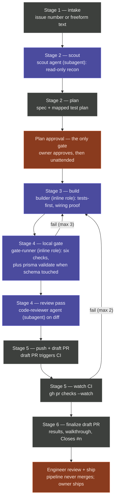

# `/ci-pipeline` — stage flow

Visual companion to the design spec
([2026-07-22-ci-pipeline-command-design.md](../superpowers/specs/2026-07-22-ci-pipeline-command-design.md))
and the command (`.claude/commands/ci-pipeline.md`).

## Legend and execution model

- **Gray — orchestrator step**: the main session executing the command directly.
- **Purple — named agent role** (reusable definitions in `.claude/agents/`):
  - `scout` and `code-reviewer` run as **dispatched subagents**.
  - `builder` and `gate-runner` are contracts the orchestrator **assumes
    inline** — deliberately, so fix-loops keep memory of prior attempts.
- **Rust — owner (human)**: the only two human touchpoints. Plan approval is
  the single mid-pipeline gate; everything after it runs unattended until the
  finalized draft PR arrives for Engineer Review. The pipeline never merges.

## Fail-loops

- **Local gate → build** (max 3): failing command output, verbatim, becomes the
  next build instruction; the full gate re-runs from the top after each fix.
- **Watch CI → build** (max 2): `gh run view <id> --log-failed` output becomes
  the next build instruction; the full local gate re-runs before re-push.
- Hitting either cap produces an honest failure report — never a silent stall,
  never a weakened test, never a red push.

## Vague-ticket path (not shown)

If intake cannot produce testable acceptance criteria, numbered clarifying
questions surface *at* the plan-approval gate rather than as extra stops — the
"only gate" property holds on every path.
