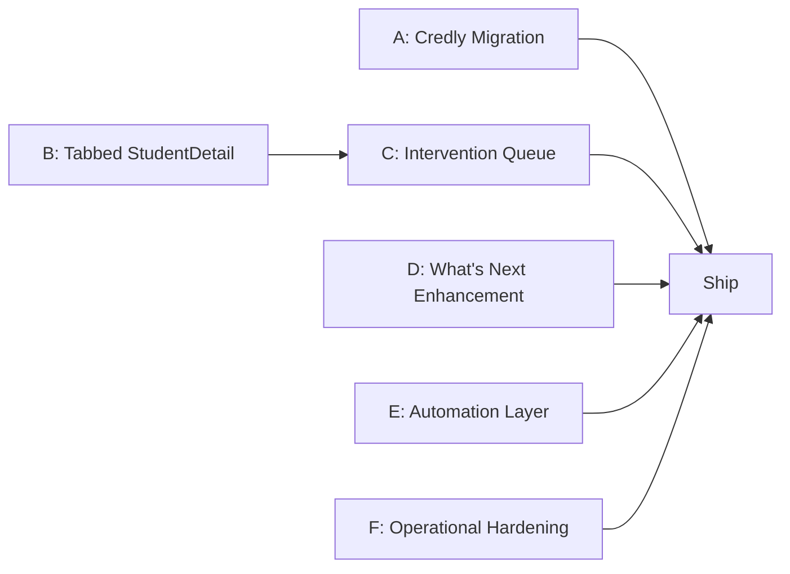

# Product Gap Closure Implementation Plan

> **For agentic workers:** REQUIRED SUB-SKILL: Use superpowers:subagent-driven-development (recommended) or superpowers:executing-plans to implement this plan task-by-task. Steps use checkbox (`- [ ]`) syntax for tracking.

**Goal:** Close the 7 product gaps identified in `docs/PRODUCT_GAP_MEMO.md` by compressing workflows, fixing the teacher experience, and adding operational measurement loops.

**Architecture:** Six independent subsystems that can be parallelized where noted. The student and teacher UIs are modified in place following existing Next.js App Router patterns with `(student)` and `(teacher)` route groups. New API routes follow the existing `src/app/api/` pattern with Prisma queries. All components use TypeScript, Tailwind CSS 4, and Phosphor Icons. Tests use Playwright for E2E and Vitest/Jest for unit tests.

**Tech Stack:** Next.js 16 (App Router), TypeScript, Prisma 6, Supabase PostgreSQL, Tailwind CSS 4, Phosphor Icons, Playwright

**Source Docs:**
- `docs/PRODUCT_GAP_MEMO.md` — gap analysis (7 gaps, prioritized Now/Next/Later)
- `docs/FRAMEWORK_APPLICATION.md` — authoritative scope decisions and action plan
- `PRODUCT_CHARTER.md` — 90-day outcomes and phase build order
- `docs/AGENT_ORIENTATION.md` — mission, purpose, decision lens

---

## Status of Framework Action Plan

Items already completed in the codebase (verified April 1, 2026):

| Action | Status | Evidence |
|--------|--------|----------|
| Restore Vision Board, Files, Resources to nav | DONE | `src/lib/nav-items.ts:23-27` — secondary nav items |
| Remove 7 module cards from dashboard | DONE | `DashboardClient.tsx` — 4 clean sections only |
| Delete redirect pages | DONE | `/spokes/`, `/events/`, `/opportunities/`, `/courses/`, `/certifications/` do not exist |
| Remove Orientation from main nav | DONE | Not in `nav-items.ts` primary or secondary arrays |
| Move Settings to profile menu | DONE | Not in `nav-items.ts`; accessible via profile menu in NavBar |
| Make Sage a floating action button | DONE | `SageMiniChat` floats bottom-right; mobile FAB in NavBar |
| Compress dashboard to 4 sections | DONE | Mountain, What's Next, Progress, Advising |

Items remaining (this plan):

| Action | Subsystem | Gap Addressed |
|--------|-----------|---------------|
| Move Credly from Settings to Learning/Portfolio | A | Gap 2 (scope clarity) |
| Build tabbed StudentDetail | B | Gap 1, 3 (split workflows, teacher hunting) |
| Build teacher intervention queue | C | Gap 3, 4 (teacher hunting, outcome measurement) |
| Enhance Home "What's Next" | D | Gap 1 (connected workflows) |
| Goal stale detection + reminders | E | Gap 4 (outcome measurement) |
| CSP headers + OAuth password fix | F | Gap 7 (operational hardening) |

---

## File Structure

### Subsystem A: Credly Migration
- Modify: `src/app/(student)/settings/page.tsx` — remove Credly section
- Modify: `src/app/(student)/learning/page.tsx` — add Credly username input
- No new files needed; `CredlyBadges.tsx` and API routes stay as-is

### Subsystem B: Tabbed StudentDetail
- Create: `src/components/teacher/student-detail/StudentDetailTabs.tsx` — tab shell with 4 tabs
- Create: `src/components/teacher/student-detail/OverviewTab.tsx` — identity, readiness, alerts, career summary
- Create: `src/components/teacher/student-detail/GoalsPlanTab.tsx` — goal tree, support planner, evidence, review queue
- Create: `src/components/teacher/student-detail/ProgressTab.tsx` — orientation, certifications, portfolio, conversations
- Create: `src/components/teacher/student-detail/OperationsTab.tsx` — forms, notes, appointments, tasks, SPOKES record
- Modify: `src/components/teacher/StudentDetail.tsx` — replace monolith with tab shell import
- Create: `src/components/teacher/student-detail/types.ts` — shared interfaces extracted from StudentDetail
- Test: `e2e/teacher-student-detail-tabs.spec.ts`

### Subsystem C: Teacher Intervention Queue
- Create: `src/components/teacher/InterventionQueue.tsx` — priority-sorted student list with one-click actions
- Create: `src/app/api/teacher/intervention-queue/route.ts` — API: stalled students sorted by urgency
- Create: `src/lib/intervention-scoring.ts` — urgency scoring algorithm
- Modify: `src/app/(teacher)/teacher/page.tsx` — add intervention queue above or replacing ClassOverview
- Modify: `src/components/teacher/ClassOverview.tsx` — integrate queue toggle or tab
- Test: `e2e/teacher-intervention-queue.spec.ts`
- Test: `src/lib/__tests__/intervention-scoring.test.ts`

### Subsystem D: Home What's Next Enhancement
- Modify: `src/app/(student)/dashboard/page.tsx` — expand orientation data passed to client
- Modify: `src/app/(student)/dashboard/DashboardClient.tsx` — render incomplete orientation items inline in What's Next
- Test: `e2e/student-dashboard-whats-next.spec.ts`

### Subsystem E: Automation Layer
- Create: `src/app/api/cron/goal-stale-detection/route.ts` — detect stale goals, create alerts
- Create: `src/app/api/cron/orientation-reminders/route.ts` — send reminders for incomplete orientation
- Create: `src/app/api/teacher/reports/readiness-monthly/route.ts` — monthly readiness rollup
- Create: `src/lib/stale-goal-rules.ts` — staleness thresholds and detection logic
- Modify: `prisma/schema.prisma` — add `lastReviewedAt` to Goal model if not present
- Test: `src/lib/__tests__/stale-goal-rules.test.ts`

### Subsystem F: Operational Hardening
- Create: `src/middleware-csp.ts` — CSP header generation with Next.js nonce support
- Modify: `src/middleware.ts` — add CSP headers to responses
- Modify: `src/app/api/auth/register/route.ts` — fix OAuth users getting random password hash
- Test: `e2e/csp-headers.spec.ts`

---

## Subsystem A: Credly Migration (Settings → Learning)

**Gap addressed:** Gap 2 — Credly in Settings is a misplaced feature. It belongs where the student understands why (Learning page, next to their badges).

**Parallelizable:** Yes — fully independent of B-F.

### Task A1: Move Credly username input to Learning page

**Files:**
- Modify: `src/app/(student)/settings/page.tsx`
- Modify: `src/app/(student)/learning/page.tsx`

- [ ] **Step 1: Read the current Credly section in Settings**

Read `src/app/(student)/settings/page.tsx` to identify the exact Credly-related state variables and JSX. The Credly section uses:
- A fetch to `/api/settings/credly` on mount
- State for `credlyUsername` and save/delete handlers
- JSX rendering a username input field with save/remove buttons

- [ ] **Step 2: Add Credly username management to Learning page**

In `src/app/(student)/learning/page.tsx`, the `CredlyBadges` component already exists and displays badges. Add a small "Connect Credly" card above or within the credentials section that:
- Fetches current username from `/api/settings/credly` on mount
- Shows an input field if no username is set
- Shows current username + "Disconnect" button if set
- Calls POST/DELETE to the existing API routes

Extract this into a new component if the Learning page doesn't already have the input:

```tsx
// Add to learning/page.tsx or create src/components/certifications/CredlyConnect.tsx
"use client";

import { useEffect, useState } from "react";

export function CredlyConnect() {
  const [username, setUsername] = useState("");
  const [saved, setSaved] = useState<string | null>(null);
  const [status, setStatus] = useState<"idle" | "saving" | "error">("idle");

  useEffect(() => {
    fetch("/api/settings/credly")
      .then((r) => r.json())
      .then((data) => {
        if (data.username) setSaved(data.username);
      })
      .catch(() => {});
  }, []);

  const handleSave = async () => {
    if (!username.trim()) return;
    setStatus("saving");
    const res = await fetch("/api/settings/credly", {
      method: "POST",
      headers: { "Content-Type": "application/json" },
      body: JSON.stringify({ username: username.trim() }),
    });
    if (res.ok) {
      const data = await res.json();
      setSaved(data.username);
      setUsername("");
      setStatus("idle");
    } else {
      setStatus("error");
    }
  };

  const handleDisconnect = async () => {
    await fetch("/api/settings/credly", { method: "DELETE" });
    setSaved(null);
  };

  if (saved) {
    return (
      <div className="flex items-center gap-3 rounded-xl border border-emerald-200 bg-emerald-50/50 px-4 py-3">
        <span className="text-sm text-emerald-800">
          Connected as <strong>{saved}</strong>
        </span>
        <button
          onClick={handleDisconnect}
          className="ml-auto text-sm text-red-600 hover:underline"
        >
          Disconnect
        </button>
      </div>
    );
  }

  return (
    <div className="flex items-center gap-2">
      <input
        type="text"
        value={username}
        onChange={(e) => setUsername(e.target.value)}
        placeholder="Credly username or profile URL"
        className="flex-1 rounded-lg border px-3 py-2 text-sm"
      />
      <button
        onClick={handleSave}
        disabled={status === "saving" || !username.trim()}
        className="primary-button px-4 py-2 text-sm disabled:opacity-50"
      >
        {status === "saving" ? "Saving..." : "Connect"}
      </button>
    </div>
  );
}
```

- [ ] **Step 3: Remove Credly section from Settings page**

In `src/app/(student)/settings/page.tsx`, remove:
- Any Credly-related state variables
- Any Credly fetch calls from the `useEffect`
- The Credly JSX section

Note: If Settings has no Credly section (it may only be in Learning already via `CredlyBadges`), verify by searching for "credly" in the file. If absent, skip this step.

- [ ] **Step 4: Verify the Learning page renders CredlyConnect + CredlyBadges**

Run the dev server and navigate to `/learning`. Confirm:
- The Connect Credly input appears
- After entering a username, badges load below
- Disconnect removes the username and hides badges

```bash
cd /Users/brittlegg/visionquest && npm run dev
```

- [ ] **Step 5: Commit**

```bash
git add src/components/certifications/CredlyConnect.tsx src/app/\(student\)/learning/page.tsx src/app/\(student\)/settings/page.tsx
git commit -m "refactor: move Credly integration from Settings to Learning page

Credly username management now lives next to the badge display on the
Learning page, where students understand why they need it. Removed the
orphaned Credly section from Settings."
```

---

## Subsystem B: Tabbed StudentDetail

**Gap addressed:** Gap 1 (workflows split across surfaces), Gap 3 (teacher hunting through 15+ sections)

**Parallelizable:** Yes — independent of A, D, E, F. Should complete before C (intervention queue links into student detail).

**Current state:** `StudentDetail.tsx` is 2043 lines with 15+ sections rendered sequentially. The Framework says to split into 4 tabs: Overview, Goals & Plan, Progress, Operations.

### Task B1: Extract shared interfaces into types file

**Files:**
- Create: `src/components/teacher/student-detail/types.ts`
- Read: `src/components/teacher/StudentDetail.tsx:1-200`

- [ ] **Step 1: Create the types file**

Extract all interface definitions from `StudentDetail.tsx` (lines 1-200) into a shared types file. These are the data interfaces used across all tabs:

```typescript
// src/components/teacher/student-detail/types.ts

export interface MoodEntryData {
  id: string;
  score: number;
  context: string | null;
  extractedAt: string;
}

export interface GoalData {
  id: string;
  level: string;
  content: string;
  status: string;
  parentId: string | null;
  createdAt: string;
}

export interface OrientationItemData {
  id: string;
  label: string;
  required: boolean;
}

export interface OrientationProgressData {
  itemId: string;
  completed: boolean;
  completedAt: string | null;
}

export interface CertTemplateData {
  id: string;
  label: string;
  required: boolean;
  needsFile: boolean;
  needsVerify: boolean;
  url: string | null;
}

export interface CertRequirementData {
  id: string;
  templateId: string;
  completed: boolean;
  completedAt: string | null;
  verifiedBy: string | null;
  verifiedAt: string | null;
  fileId: string | null;
  notes: string | null;
}

export interface ConversationSummary {
  id: string;
  module: string;
  stage: string;
  title: string | null;
  updatedAt: string;
  lastMessagePreview: string | null;
  messageCount: number;
  userMessageCount: number;
  createdAt: string;
  duration: number | null;
}

export interface PortfolioItemData {
  id: string;
  title: string;
  type: string;
  createdAt: string;
}

export interface FileData {
  id: string;
  filename: string;
  category: string;
  uploadedAt: string;
}

export interface AppointmentData {
  id: string;
  title: string;
  description: string | null;
  startsAt: string;
  endsAt: string;
  status: string;
  locationType: string;
  locationLabel: string | null;
  meetingUrl: string | null;
  notes: string | null;
  followUpRequired: boolean;
  advisorName: string;
}

export interface TaskData {
  id: string;
  title: string;
  description: string | null;
  dueAt: string | null;
  status: string;
  priority: string;
  completedAt: string | null;
  createdAt: string;
  appointmentId: string | null;
  createdByName: string;
}

export interface NoteData {
  id: string;
  category: string;
  body: string;
  visibility: string;
  createdAt: string;
  authorName: string;
}

export interface AlertData {
  id: string;
  type: string;
  severity: string;
  title: string;
  summary: string;
  sourceType: string | null;
  sourceId: string | null;
  detectedAt: string;
}

export interface GoalEvidenceData {
  goalId: string;
  linkId: string;
  resourceType: string;
  resourceId: string;
  title: string;
  linkStatus: string;
  evidenceStatus: "not_started" | "in_progress" | "submitted" | "completed" | "approved" | "blocked";
  evidenceSource: "none" | "student_update" | "system" | "teacher_review";
  reviewNeeded: boolean;
  evidenceLabel: string;
  summary: string;
  lastObservedAt: string | null;
  dueAt: string | null;
  notes: string | null;
}

export interface ReviewQueueItemData {
  key: string;
  kind: "goal_needs_resource" | "goal_resource_stale" | "goal_review_pending";
  severity: "medium" | "high";
  goalId: string;
  goalTitle: string;
  linkId: string | null;
  resourceTitle: string | null;
  summary: string;
  dueAt: string | null;
  detectedAt: string | null;
}

export interface FormSubmissionData {
  id: string;
  formId: string;
  title: string;
  description: string | null;
  status: string;
  createdAt: string;
  updatedAt: string;
  reviewedAt: string | null;
  notes: string | null;
  file: {
    id: string;
    filename: string;
    mimeType: string;
    uploadedAt: string;
  } | null;
  signatureFile: {
    id: string;
    filename: string;
  } | null;
}

export interface PublicCredentialPageData {
  isPublic: boolean;
  slug: string;
  headline: string | null;
  updatedAt?: string;
}

export interface ApplicationData {
  id: string;
  title: string;
  company: string;
  status: string;
  appliedAt: string;
  updatedAt: string;
}

// Props shared by all tab components
export interface StudentTabProps {
  studentId: string;
  studentName: string;
}
```

Note: Copy the exact interfaces from the current `StudentDetail.tsx`. The above is based on lines 1-200; verify each interface matches exactly. Add any missing interfaces found in the rest of the file.

- [ ] **Step 2: Commit the types file**

```bash
git add src/components/teacher/student-detail/types.ts
git commit -m "refactor: extract StudentDetail interfaces to shared types file"
```

### Task B2: Create the tab shell component

**Files:**
- Create: `src/components/teacher/student-detail/StudentDetailTabs.tsx`

- [ ] **Step 1: Write the tab shell**

This component manages which tab is active and renders the appropriate tab content. It receives all the data that `StudentDetail` currently fetches and distributes it to tab components.

```tsx
// src/components/teacher/student-detail/StudentDetailTabs.tsx
"use client";

import { useState } from "react";
import {
  UserCircle,
  Target,
  ChartLineUp,
  Clipboard,
} from "@phosphor-icons/react";

type TabKey = "overview" | "goals" | "progress" | "operations";

interface TabDef {
  key: TabKey;
  label: string;
  icon: typeof UserCircle;
}

const TABS: TabDef[] = [
  { key: "overview", label: "Overview", icon: UserCircle },
  { key: "goals", label: "Goals & Plan", icon: Target },
  { key: "progress", label: "Progress", icon: ChartLineUp },
  { key: "operations", label: "Operations", icon: Clipboard },
];

interface StudentDetailTabsProps {
  studentId: string;
  studentName: string;
  children: Record<TabKey, React.ReactNode>;
}

export default function StudentDetailTabs({
  studentId,
  studentName,
  children,
}: StudentDetailTabsProps) {
  const [activeTab, setActiveTab] = useState<TabKey>("overview");

  return (
    <div>
      {/* Tab bar */}
      <div className="mb-6 flex gap-1 rounded-xl bg-gray-100 p-1">
        {TABS.map((tab) => {
          const Icon = tab.icon;
          return (
            <button
              key={tab.key}
              onClick={() => setActiveTab(tab.key)}
              className={`flex flex-1 items-center justify-center gap-2 rounded-lg py-2.5 text-sm font-medium transition-colors ${
                activeTab === tab.key
                  ? "bg-white text-gray-900 shadow-sm"
                  : "text-gray-500 hover:text-gray-700"
              }`}
            >
              <Icon size={18} weight={activeTab === tab.key ? "fill" : "regular"} />
              <span className="hidden sm:inline">{tab.label}</span>
            </button>
          );
        })}
      </div>

      {/* Active tab content */}
      <div>{children[activeTab]}</div>
    </div>
  );
}
```

- [ ] **Step 2: Commit the tab shell**

```bash
git add src/components/teacher/student-detail/StudentDetailTabs.tsx
git commit -m "feat: add StudentDetail tab shell component with 4 tabs"
```

### Task B3: Create OverviewTab

**Files:**
- Create: `src/components/teacher/student-detail/OverviewTab.tsx`
- Read: `src/components/teacher/StudentDetail.tsx` — identify the identity, readiness, alerts, and career sections

- [ ] **Step 1: Read StudentDetail.tsx to find Overview-related sections**

Read the full `StudentDetail.tsx` and identify JSX blocks for:
- Student identity/header (name, email, cohort, enrollment date)
- Readiness score + breakdown
- Top alerts (severity-sorted, limited to 5)
- Career discovery summary (if present)
- Mood sparkline

- [ ] **Step 2: Create OverviewTab extracting those sections**

Create `src/components/teacher/student-detail/OverviewTab.tsx`. Move the relevant JSX and state from `StudentDetail.tsx` into this component. The component receives its data as props (fetched by the parent).

The exact code depends on what's found in Step 1, but the structure is:

```tsx
"use client";

import type {
  MoodEntryData,
  AlertData,
  StudentTabProps,
} from "./types";
import type { ReadinessBreakdown } from "@/lib/progression/readiness-score";
import ReadinessScore from "@/components/ui/ReadinessScore";
import { MoodSparkline } from "@/components/progression/MoodSparkline";

interface OverviewTabProps extends StudentTabProps {
  email: string;
  cohort: string | null;
  enrolledAt: string;
  readinessScore: number;
  readinessBreakdown: ReadinessBreakdown;
  moods: MoodEntryData[];
  alerts: AlertData[];
  careerCluster: string | null;
  onDismissAlert: (id: string) => void;
}

export default function OverviewTab({
  studentName,
  email,
  cohort,
  enrolledAt,
  readinessScore,
  readinessBreakdown,
  moods,
  alerts,
  careerCluster,
  onDismissAlert,
}: OverviewTabProps) {
  const topAlerts = alerts
    .filter((a) => a.severity === "high" || a.severity === "critical")
    .slice(0, 5);

  return (
    <div className="space-y-6">
      {/* Identity header */}
      <section className="surface-section p-5">
        <h3 className="text-lg font-semibold">{studentName}</h3>
        <p className="text-sm text-gray-500">{email}</p>
        {cohort && <p className="text-sm text-gray-500">Cohort: {cohort}</p>}
        <p className="text-sm text-gray-500">
          Enrolled: {new Date(enrolledAt).toLocaleDateString()}
        </p>
        {careerCluster && (
          <p className="mt-2 text-sm">
            Career direction: <strong>{careerCluster}</strong>
          </p>
        )}
      </section>

      {/* Readiness + Mood row */}
      <div className="grid gap-4 md:grid-cols-2">
        <section className="surface-section p-5">
          <h4 className="mb-3 text-sm font-semibold uppercase tracking-wider text-gray-500">
            Readiness
          </h4>
          <ReadinessScore score={readinessScore} breakdown={readinessBreakdown} />
        </section>
        <section className="surface-section p-5">
          <h4 className="mb-3 text-sm font-semibold uppercase tracking-wider text-gray-500">
            Mood Trend
          </h4>
          <MoodSparkline entries={moods} />
        </section>
      </div>

      {/* Top alerts */}
      {topAlerts.length > 0 && (
        <section className="surface-section p-5">
          <h4 className="mb-3 text-sm font-semibold uppercase tracking-wider text-red-600">
            Alerts ({topAlerts.length})
          </h4>
          <ul className="space-y-2">
            {topAlerts.map((alert) => (
              <li
                key={alert.id}
                className="flex items-start justify-between rounded-lg border border-red-100 bg-red-50/50 p-3"
              >
                <div>
                  <p className="text-sm font-medium">{alert.title}</p>
                  <p className="text-xs text-gray-600">{alert.summary}</p>
                </div>
                <button
                  onClick={() => onDismissAlert(alert.id)}
                  className="text-xs text-gray-400 hover:text-gray-600"
                >
                  Dismiss
                </button>
              </li>
            ))}
          </ul>
        </section>
      )}
    </div>
  );
}
```

Adjust props and JSX to match the exact data shapes found in Step 1.

- [ ] **Step 3: Commit**

```bash
git add src/components/teacher/student-detail/OverviewTab.tsx
git commit -m "feat: create OverviewTab for StudentDetail (identity, readiness, alerts)"
```

### Task B4: Create GoalsPlanTab

**Files:**
- Create: `src/components/teacher/student-detail/GoalsPlanTab.tsx`

- [ ] **Step 1: Read StudentDetail.tsx to find Goals-related sections**

Identify JSX blocks for:
- GoalTree component usage
- GoalSupportPlanner component usage
- Goal evidence display
- Review queue rendering

- [ ] **Step 2: Create GoalsPlanTab extracting those sections**

Move the goals tree, support planner, evidence tracking, and review queue JSX into this tab. Import `GoalTree` and `GoalSupportPlanner` from their existing locations.

```tsx
"use client";

import type {
  GoalData,
  GoalEvidenceData,
  ReviewQueueItemData,
  StudentTabProps,
} from "./types";
import GoalTree from "../GoalTree";
import GoalSupportPlanner from "../GoalSupportPlanner";

interface GoalsPlanTabProps extends StudentTabProps {
  goals: GoalData[];
  evidence: GoalEvidenceData[];
  reviewQueue: ReviewQueueItemData[];
  onRefreshGoals: () => void;
}

export default function GoalsPlanTab({
  studentId,
  studentName,
  goals,
  evidence,
  reviewQueue,
  onRefreshGoals,
}: GoalsPlanTabProps) {
  const highPriorityReviews = reviewQueue.filter((r) => r.severity === "high");

  return (
    <div className="space-y-6">
      {/* Review queue — top of tab for urgency */}
      {reviewQueue.length > 0 && (
        <section className="surface-section border-l-4 border-amber-400 p-5">
          <h4 className="mb-3 text-sm font-semibold uppercase tracking-wider text-amber-700">
            Needs Review ({reviewQueue.length})
          </h4>
          <ul className="space-y-2">
            {reviewQueue.map((item) => (
              <li key={item.key} className="rounded-lg bg-amber-50/50 p-3">
                <p className="text-sm font-medium">{item.goalTitle}</p>
                <p className="text-xs text-gray-600">{item.summary}</p>
              </li>
            ))}
          </ul>
        </section>
      )}

      {/* Goal tree */}
      <section className="surface-section p-5">
        <h4 className="mb-3 text-sm font-semibold uppercase tracking-wider text-gray-500">
          Goal Hierarchy
        </h4>
        <GoalTree goals={goals} studentId={studentId} onRefresh={onRefreshGoals} />
      </section>

      {/* Support planner */}
      <section className="surface-section p-5">
        <h4 className="mb-3 text-sm font-semibold uppercase tracking-wider text-gray-500">
          Support Plan
        </h4>
        <GoalSupportPlanner studentId={studentId} goals={goals} />
      </section>

      {/* Evidence tracking */}
      {evidence.length > 0 && (
        <section className="surface-section p-5">
          <h4 className="mb-3 text-sm font-semibold uppercase tracking-wider text-gray-500">
            Evidence ({evidence.length})
          </h4>
          <ul className="space-y-2">
            {evidence.map((e) => (
              <li key={e.linkId} className="flex items-center justify-between rounded-lg border p-3">
                <div>
                  <p className="text-sm font-medium">{e.title}</p>
                  <p className="text-xs text-gray-500">{e.evidenceLabel}</p>
                </div>
                <span className={`rounded-full px-2 py-0.5 text-xs font-medium ${
                  e.evidenceStatus === "approved" ? "bg-emerald-100 text-emerald-700" :
                  e.evidenceStatus === "submitted" ? "bg-blue-100 text-blue-700" :
                  e.evidenceStatus === "blocked" ? "bg-red-100 text-red-700" :
                  "bg-gray-100 text-gray-600"
                }`}>
                  {e.evidenceStatus}
                </span>
              </li>
            ))}
          </ul>
        </section>
      )}
    </div>
  );
}
```

Adjust props and component usage to match exact patterns found in StudentDetail.tsx.

- [ ] **Step 3: Commit**

```bash
git add src/components/teacher/student-detail/GoalsPlanTab.tsx
git commit -m "feat: create GoalsPlanTab for StudentDetail (goals, evidence, reviews)"
```

### Task B5: Create ProgressTab

**Files:**
- Create: `src/components/teacher/student-detail/ProgressTab.tsx`

- [ ] **Step 1: Read StudentDetail.tsx to find Progress-related sections**

Identify JSX blocks for:
- Orientation checklist with completion status
- Certification templates and requirements
- Portfolio items display
- Conversation summaries

- [ ] **Step 2: Create ProgressTab extracting those sections**

```tsx
"use client";

import type {
  OrientationItemData,
  OrientationProgressData,
  CertTemplateData,
  CertRequirementData,
  PortfolioItemData,
  ConversationSummary,
  StudentTabProps,
} from "./types";

interface ProgressTabProps extends StudentTabProps {
  orientationItems: OrientationItemData[];
  orientationProgress: OrientationProgressData[];
  certTemplates: CertTemplateData[];
  certRequirements: CertRequirementData[];
  portfolioItems: PortfolioItemData[];
  conversations: ConversationSummary[];
}

export default function ProgressTab({
  orientationItems,
  orientationProgress,
  certTemplates,
  certRequirements,
  portfolioItems,
  conversations,
}: ProgressTabProps) {
  const completedOrientation = orientationProgress.filter((p) => p.completed).length;
  const totalOrientation = orientationItems.length;
  const orientationPct = totalOrientation > 0
    ? Math.round((completedOrientation / totalOrientation) * 100)
    : 0;

  return (
    <div className="space-y-6">
      {/* Orientation progress */}
      <section className="surface-section p-5">
        <div className="mb-3 flex items-center justify-between">
          <h4 className="text-sm font-semibold uppercase tracking-wider text-gray-500">
            Orientation
          </h4>
          <span className="text-sm font-medium text-gray-700">
            {completedOrientation}/{totalOrientation} ({orientationPct}%)
          </span>
        </div>
        <div className="mb-3 h-2 overflow-hidden rounded-full bg-gray-200">
          <div
            className="h-full rounded-full bg-emerald-500 transition-all"
            style={{ width: `${orientationPct}%` }}
          />
        </div>
        <ul className="space-y-1">
          {orientationItems.map((item) => {
            const progress = orientationProgress.find((p) => p.itemId === item.id);
            return (
              <li key={item.id} className="flex items-center gap-2 text-sm">
                <span className={progress?.completed ? "text-emerald-600" : "text-gray-400"}>
                  {progress?.completed ? "✓" : "○"}
                </span>
                <span className={progress?.completed ? "text-gray-700" : "text-gray-500"}>
                  {item.label}
                </span>
                {item.required && !progress?.completed && (
                  <span className="text-xs text-red-500">required</span>
                )}
              </li>
            );
          })}
        </ul>
      </section>

      {/* Certifications */}
      <section className="surface-section p-5">
        <h4 className="mb-3 text-sm font-semibold uppercase tracking-wider text-gray-500">
          Certifications ({certRequirements.filter((r) => r.completed).length}/{certTemplates.length})
        </h4>
        <ul className="space-y-2">
          {certTemplates.map((tmpl) => {
            const req = certRequirements.find((r) => r.templateId === tmpl.id);
            return (
              <li key={tmpl.id} className="flex items-center justify-between rounded-lg border p-3">
                <div>
                  <p className="text-sm font-medium">{tmpl.label}</p>
                  {tmpl.required && <span className="text-xs text-amber-600">Required</span>}
                </div>
                <span className={`rounded-full px-2 py-0.5 text-xs font-medium ${
                  req?.completed ? "bg-emerald-100 text-emerald-700" : "bg-gray-100 text-gray-600"
                }`}>
                  {req?.completed ? "Complete" : "Pending"}
                </span>
              </li>
            );
          })}
        </ul>
      </section>

      {/* Portfolio */}
      {portfolioItems.length > 0 && (
        <section className="surface-section p-5">
          <h4 className="mb-3 text-sm font-semibold uppercase tracking-wider text-gray-500">
            Portfolio ({portfolioItems.length})
          </h4>
          <ul className="space-y-1">
            {portfolioItems.map((item) => (
              <li key={item.id} className="flex items-center justify-between text-sm">
                <span>{item.title}</span>
                <span className="text-xs text-gray-400">{item.type}</span>
              </li>
            ))}
          </ul>
        </section>
      )}

      {/* Conversations */}
      {conversations.length > 0 && (
        <section className="surface-section p-5">
          <h4 className="mb-3 text-sm font-semibold uppercase tracking-wider text-gray-500">
            Sage Conversations ({conversations.length})
          </h4>
          <ul className="space-y-2">
            {conversations.slice(0, 10).map((conv) => (
              <li key={conv.id} className="rounded-lg border p-3">
                <div className="flex items-center justify-between">
                  <p className="text-sm font-medium">{conv.title ?? conv.module}</p>
                  <span className="text-xs text-gray-400">
                    {conv.messageCount} messages
                  </span>
                </div>
                {conv.lastMessagePreview && (
                  <p className="mt-1 truncate text-xs text-gray-500">
                    {conv.lastMessagePreview}
                  </p>
                )}
              </li>
            ))}
          </ul>
        </section>
      )}
    </div>
  );
}
```

- [ ] **Step 3: Commit**

```bash
git add src/components/teacher/student-detail/ProgressTab.tsx
git commit -m "feat: create ProgressTab for StudentDetail (orientation, certs, portfolio, conversations)"
```

### Task B6: Create OperationsTab

**Files:**
- Create: `src/components/teacher/student-detail/OperationsTab.tsx`

- [ ] **Step 1: Read StudentDetail.tsx to find Operations-related sections**

Identify JSX blocks for:
- Form submissions + signatures
- Notes (by category, with visibility)
- Appointments + tasks
- SPOKES record
- Public credential page settings
- Application tracking

- [ ] **Step 2: Create OperationsTab extracting those sections**

```tsx
"use client";

import type {
  FormSubmissionData,
  NoteData,
  AppointmentData,
  TaskData,
  PublicCredentialPageData,
  ApplicationData,
  StudentTabProps,
} from "./types";

interface OperationsTabProps extends StudentTabProps {
  formSubmissions: FormSubmissionData[];
  notes: NoteData[];
  appointments: AppointmentData[];
  tasks: TaskData[];
  publicCredentialPage: PublicCredentialPageData | null;
  applications: ApplicationData[];
  onAddNote: (category: string, body: string, visibility: string) => void;
  onCreateTask: (title: string, dueAt: string | null, priority: string) => void;
}

export default function OperationsTab({
  studentId,
  formSubmissions,
  notes,
  appointments,
  tasks,
  publicCredentialPage,
  applications,
  onAddNote,
  onCreateTask,
}: OperationsTabProps) {
  // Group notes by category
  const notesByCategory = notes.reduce<Record<string, NoteData[]>>((acc, note) => {
    const cat = note.category || "general";
    return { ...acc, [cat]: [...(acc[cat] ?? []), note] };
  }, {});

  const openTasks = tasks.filter((t) => t.status !== "completed");
  const completedTasks = tasks.filter((t) => t.status === "completed");

  return (
    <div className="space-y-6">
      {/* Tasks */}
      <section className="surface-section p-5">
        <h4 className="mb-3 text-sm font-semibold uppercase tracking-wider text-gray-500">
          Tasks ({openTasks.length} open)
        </h4>
        {openTasks.length === 0 ? (
          <p className="text-sm text-gray-400">No open tasks</p>
        ) : (
          <ul className="space-y-2">
            {openTasks.map((task) => (
              <li key={task.id} className="flex items-center justify-between rounded-lg border p-3">
                <div>
                  <p className="text-sm font-medium">{task.title}</p>
                  {task.dueAt && (
                    <p className="text-xs text-gray-500">
                      Due: {new Date(task.dueAt).toLocaleDateString()}
                    </p>
                  )}
                </div>
                <span className={`rounded-full px-2 py-0.5 text-xs font-medium ${
                  task.priority === "high" ? "bg-red-100 text-red-700" :
                  task.priority === "medium" ? "bg-amber-100 text-amber-700" :
                  "bg-gray-100 text-gray-600"
                }`}>
                  {task.priority}
                </span>
              </li>
            ))}
          </ul>
        )}
      </section>

      {/* Appointments */}
      <section className="surface-section p-5">
        <h4 className="mb-3 text-sm font-semibold uppercase tracking-wider text-gray-500">
          Appointments ({appointments.length})
        </h4>
        <ul className="space-y-2">
          {appointments.map((apt) => (
            <li key={apt.id} className="rounded-lg border p-3">
              <div className="flex items-center justify-between">
                <p className="text-sm font-medium">{apt.title}</p>
                <span className={`rounded-full px-2 py-0.5 text-xs font-medium ${
                  apt.status === "completed" ? "bg-emerald-100 text-emerald-700" :
                  apt.status === "scheduled" ? "bg-blue-100 text-blue-700" :
                  "bg-gray-100 text-gray-600"
                }`}>
                  {apt.status}
                </span>
              </div>
              <p className="text-xs text-gray-500">
                {new Date(apt.startsAt).toLocaleString()}
              </p>
            </li>
          ))}
        </ul>
      </section>

      {/* Form Submissions */}
      {formSubmissions.length > 0 && (
        <section className="surface-section p-5">
          <h4 className="mb-3 text-sm font-semibold uppercase tracking-wider text-gray-500">
            Form Submissions ({formSubmissions.length})
          </h4>
          <ul className="space-y-2">
            {formSubmissions.map((form) => (
              <li key={form.id} className="flex items-center justify-between rounded-lg border p-3">
                <div>
                  <p className="text-sm font-medium">{form.title}</p>
                  <p className="text-xs text-gray-500">
                    Submitted: {new Date(form.createdAt).toLocaleDateString()}
                  </p>
                </div>
                <span className={`rounded-full px-2 py-0.5 text-xs font-medium ${
                  form.status === "approved" ? "bg-emerald-100 text-emerald-700" :
                  form.status === "pending" ? "bg-amber-100 text-amber-700" :
                  "bg-gray-100 text-gray-600"
                }`}>
                  {form.status}
                </span>
              </li>
            ))}
          </ul>
        </section>
      )}

      {/* Notes */}
      <section className="surface-section p-5">
        <h4 className="mb-3 text-sm font-semibold uppercase tracking-wider text-gray-500">
          Notes ({notes.length})
        </h4>
        {Object.entries(notesByCategory).map(([category, catNotes]) => (
          <div key={category} className="mb-4">
            <p className="mb-2 text-xs font-semibold uppercase text-gray-400">{category}</p>
            <ul className="space-y-2">
              {catNotes.map((note) => (
                <li key={note.id} className="rounded-lg border p-3">
                  <p className="text-sm">{note.body}</p>
                  <p className="mt-1 text-xs text-gray-400">
                    {note.authorName} &middot; {new Date(note.createdAt).toLocaleDateString()}
                    {note.visibility !== "all" && (
                      <span className="ml-2 text-amber-500">({note.visibility})</span>
                    )}
                  </p>
                </li>
              ))}
            </ul>
          </div>
        ))}
      </section>

      {/* Applications */}
      {applications.length > 0 && (
        <section className="surface-section p-5">
          <h4 className="mb-3 text-sm font-semibold uppercase tracking-wider text-gray-500">
            Applications ({applications.length})
          </h4>
          <ul className="space-y-2">
            {applications.map((app) => (
              <li key={app.id} className="flex items-center justify-between rounded-lg border p-3">
                <div>
                  <p className="text-sm font-medium">{app.title}</p>
                  <p className="text-xs text-gray-500">{app.company}</p>
                </div>
                <span className="rounded-full bg-gray-100 px-2 py-0.5 text-xs font-medium text-gray-600">
                  {app.status}
                </span>
              </li>
            ))}
          </ul>
        </section>
      )}
    </div>
  );
}
```

- [ ] **Step 3: Commit**

```bash
git add src/components/teacher/student-detail/OperationsTab.tsx
git commit -m "feat: create OperationsTab for StudentDetail (forms, notes, appointments, tasks)"
```

### Task B7: Rewire StudentDetail.tsx to use tabs

**Files:**
- Modify: `src/components/teacher/StudentDetail.tsx`

- [ ] **Step 1: Read the full StudentDetail.tsx**

Read the entire file to understand:
- How data is fetched (API calls in useEffect)
- How state is managed
- The exact JSX structure being replaced

- [ ] **Step 2: Replace the monolithic render with tab components**

Keep all data fetching and state management in `StudentDetail.tsx`. Replace the sequential section rendering with the tab shell, passing data to each tab as props.

The key changes:
1. Import `StudentDetailTabs`, `OverviewTab`, `GoalsPlanTab`, `ProgressTab`, `OperationsTab`
2. Import types from `./student-detail/types` instead of inline interfaces
3. Remove all inline interface definitions (now in types.ts)
4. Replace the return JSX from a long sequential layout to:

```tsx
import StudentDetailTabs from "./student-detail/StudentDetailTabs";
import OverviewTab from "./student-detail/OverviewTab";
import GoalsPlanTab from "./student-detail/GoalsPlanTab";
import ProgressTab from "./student-detail/ProgressTab";
import OperationsTab from "./student-detail/OperationsTab";

// ... keep all existing state and fetching logic ...

return (
  <div>
    {/* Keep the student header/breadcrumb if one exists */}
    <StudentDetailTabs studentId={studentId} studentName={studentName}>
      {{
        overview: (
          <OverviewTab
            studentId={studentId}
            studentName={studentName}
            email={email}
            cohort={cohort}
            enrolledAt={enrolledAt}
            readinessScore={readinessScore}
            readinessBreakdown={readinessBreakdown}
            moods={moods}
            alerts={alerts}
            careerCluster={careerCluster}
            onDismissAlert={handleDismissAlert}
          />
        ),
        goals: (
          <GoalsPlanTab
            studentId={studentId}
            studentName={studentName}
            goals={goals}
            evidence={evidence}
            reviewQueue={reviewQueue}
            onRefreshGoals={fetchGoals}
          />
        ),
        progress: (
          <ProgressTab
            studentId={studentId}
            studentName={studentName}
            orientationItems={orientationItems}
            orientationProgress={orientationProgress}
            certTemplates={certTemplates}
            certRequirements={certRequirements}
            portfolioItems={portfolioItems}
            conversations={conversations}
          />
        ),
        operations: (
          <OperationsTab
            studentId={studentId}
            studentName={studentName}
            formSubmissions={formSubmissions}
            notes={notes}
            appointments={appointments}
            tasks={tasks}
            publicCredentialPage={publicCredentialPage}
            applications={applications}
            onAddNote={handleAddNote}
            onCreateTask={handleCreateTask}
          />
        ),
      }}
    </StudentDetailTabs>
  </div>
);
```

Adjust prop names to match the actual state variable names in the current `StudentDetail.tsx`. The implementing agent must read the full file and map each section's data to the correct tab.

- [ ] **Step 3: Run the dev server and verify all 4 tabs render**

```bash
cd /Users/brittlegg/visionquest && npm run dev
```

Navigate to `/teacher/students/[any-student-id]` and click through all 4 tabs. Verify:
- Overview shows identity, readiness, mood, alerts
- Goals & Plan shows goal tree, support planner, evidence, review queue
- Progress shows orientation, certifications, portfolio, conversations
- Operations shows tasks, appointments, forms, notes

- [ ] **Step 4: Run TypeScript check**

```bash
cd /Users/brittlegg/visionquest && npx tsc --noEmit
```

Expected: No type errors.

- [ ] **Step 5: Commit**

```bash
git add src/components/teacher/StudentDetail.tsx
git commit -m "refactor: replace monolithic StudentDetail with 4-tab layout

Splits the 2043-line StudentDetail into Overview, Goals & Plan, Progress,
and Operations tabs. Teachers can now reach any section in one click
instead of scrolling through 15+ sections."
```

### Task B8: E2E test for tabbed StudentDetail

**Files:**
- Create: `e2e/teacher-student-detail-tabs.spec.ts`

- [ ] **Step 1: Write Playwright E2E test**

```typescript
import { test, expect } from "@playwright/test";

test.describe("Teacher StudentDetail tabs", () => {
  test.beforeEach(async ({ page }) => {
    // Login as teacher — adjust credentials to match test fixtures
    await page.goto("/login");
    await page.fill('input[name="email"]', "teacher@test.com");
    await page.fill('input[name="password"]', "testpassword");
    await page.click('button[type="submit"]');
    await page.waitForURL("/teacher");
  });

  test("shows 4 tabs and defaults to Overview", async ({ page }) => {
    // Navigate to first student in the list
    await page.locator("a[href^='/teacher/students/']").first().click();
    await page.waitForURL(/\/teacher\/students\/.+/);

    // Verify 4 tab buttons exist
    await expect(page.getByRole("button", { name: /overview/i })).toBeVisible();
    await expect(page.getByRole("button", { name: /goals/i })).toBeVisible();
    await expect(page.getByRole("button", { name: /progress/i })).toBeVisible();
    await expect(page.getByRole("button", { name: /operations/i })).toBeVisible();

    // Overview tab should be active by default (has readiness section)
    await expect(page.getByText(/readiness/i)).toBeVisible();
  });

  test("can switch between tabs", async ({ page }) => {
    await page.locator("a[href^='/teacher/students/']").first().click();
    await page.waitForURL(/\/teacher\/students\/.+/);

    // Switch to Goals & Plan
    await page.getByRole("button", { name: /goals/i }).click();
    await expect(page.getByText(/goal hierarchy/i)).toBeVisible();

    // Switch to Progress
    await page.getByRole("button", { name: /progress/i }).click();
    await expect(page.getByText(/orientation/i)).toBeVisible();

    // Switch to Operations
    await page.getByRole("button", { name: /operations/i }).click();
    await expect(page.getByText(/tasks/i)).toBeVisible();
  });
});
```

- [ ] **Step 2: Run the E2E test**

```bash
cd /Users/brittlegg/visionquest && npx playwright test e2e/teacher-student-detail-tabs.spec.ts
```

Expected: Tests pass if test fixtures are seeded. If no test user exists, create seed data first.

- [ ] **Step 3: Commit**

```bash
git add e2e/teacher-student-detail-tabs.spec.ts
git commit -m "test: add E2E tests for tabbed StudentDetail navigation"
```

---

## Subsystem C: Teacher Intervention Queue

**Gap addressed:** Gap 3 (teacher "no hunting" standard), Gap 4 (outcome measurement)

**Parallelizable:** Can start after B is committed (links into student detail). Independent of A, D, E, F.

### Task C1: Create intervention urgency scoring algorithm

**Files:**
- Create: `src/lib/intervention-scoring.ts`
- Create: `src/lib/__tests__/intervention-scoring.test.ts`

- [ ] **Step 1: Write the failing test**

```typescript
// src/lib/__tests__/intervention-scoring.test.ts
import { describe, it, expect } from "vitest";
import { computeUrgencyScore, type StudentSignals } from "../intervention-scoring";

describe("computeUrgencyScore", () => {
  it("returns 0 for a fully active student", () => {
    const signals: StudentSignals = {
      daysSinceLastGoalReview: 2,
      daysSinceLastLogin: 1,
      orientationComplete: true,
      orientationProgress: 1.0,
      openAlertCount: 0,
      highSeverityAlertCount: 0,
      overdueTaskCount: 0,
      stalledGoalCount: 0,
      readinessScore: 85,
    };
    expect(computeUrgencyScore(signals)).toBe(0);
  });

  it("scores higher when goals are stale", () => {
    const active: StudentSignals = {
      daysSinceLastGoalReview: 2,
      daysSinceLastLogin: 1,
      orientationComplete: true,
      orientationProgress: 1.0,
      openAlertCount: 0,
      highSeverityAlertCount: 0,
      overdueTaskCount: 0,
      stalledGoalCount: 0,
      readinessScore: 85,
    };
    const stale: StudentSignals = {
      ...active,
      daysSinceLastGoalReview: 21,
      stalledGoalCount: 2,
    };
    expect(computeUrgencyScore(stale)).toBeGreaterThan(computeUrgencyScore(active));
  });

  it("scores higher with high-severity alerts", () => {
    const base: StudentSignals = {
      daysSinceLastGoalReview: 5,
      daysSinceLastLogin: 3,
      orientationComplete: true,
      orientationProgress: 1.0,
      openAlertCount: 0,
      highSeverityAlertCount: 0,
      overdueTaskCount: 0,
      stalledGoalCount: 0,
      readinessScore: 70,
    };
    const withAlerts: StudentSignals = {
      ...base,
      openAlertCount: 3,
      highSeverityAlertCount: 2,
    };
    expect(computeUrgencyScore(withAlerts)).toBeGreaterThan(computeUrgencyScore(base));
  });

  it("scores higher when student has not logged in recently", () => {
    const recent: StudentSignals = {
      daysSinceLastGoalReview: 5,
      daysSinceLastLogin: 1,
      orientationComplete: true,
      orientationProgress: 1.0,
      openAlertCount: 0,
      highSeverityAlertCount: 0,
      overdueTaskCount: 0,
      stalledGoalCount: 0,
      readinessScore: 70,
    };
    const absent: StudentSignals = { ...recent, daysSinceLastLogin: 14 };
    expect(computeUrgencyScore(absent)).toBeGreaterThan(computeUrgencyScore(recent));
  });

  it("scores higher with overdue tasks", () => {
    const base: StudentSignals = {
      daysSinceLastGoalReview: 5,
      daysSinceLastLogin: 3,
      orientationComplete: true,
      orientationProgress: 1.0,
      openAlertCount: 0,
      highSeverityAlertCount: 0,
      overdueTaskCount: 0,
      stalledGoalCount: 0,
      readinessScore: 70,
    };
    const overdue: StudentSignals = { ...base, overdueTaskCount: 3 };
    expect(computeUrgencyScore(overdue)).toBeGreaterThan(computeUrgencyScore(base));
  });

  it("scores higher with incomplete orientation", () => {
    const complete: StudentSignals = {
      daysSinceLastGoalReview: 5,
      daysSinceLastLogin: 3,
      orientationComplete: true,
      orientationProgress: 1.0,
      openAlertCount: 0,
      highSeverityAlertCount: 0,
      overdueTaskCount: 0,
      stalledGoalCount: 0,
      readinessScore: 70,
    };
    const incomplete: StudentSignals = {
      ...complete,
      orientationComplete: false,
      orientationProgress: 0.3,
    };
    expect(computeUrgencyScore(incomplete)).toBeGreaterThan(computeUrgencyScore(complete));
  });
});
```

- [ ] **Step 2: Run test to verify it fails**

```bash
cd /Users/brittlegg/visionquest && npx vitest run src/lib/__tests__/intervention-scoring.test.ts
```

Expected: FAIL — module not found.

- [ ] **Step 3: Write the implementation**

```typescript
// src/lib/intervention-scoring.ts

export interface StudentSignals {
  daysSinceLastGoalReview: number;
  daysSinceLastLogin: number;
  orientationComplete: boolean;
  orientationProgress: number; // 0.0 to 1.0
  openAlertCount: number;
  highSeverityAlertCount: number;
  overdueTaskCount: number;
  stalledGoalCount: number;
  readinessScore: number; // 0-100
}

/**
 * Computes an urgency score (0 = no intervention needed, higher = more urgent).
 *
 * Weights:
 * - Stalled goals: 15 points per stalled goal
 * - High-severity alerts: 20 points each
 * - Open alerts: 5 points each
 * - Days since login > 7: 3 points per day over 7
 * - Days since goal review > 14: 2 points per day over 14
 * - Overdue tasks: 10 points each
 * - Incomplete orientation: 25 * (1 - progress)
 * - Low readiness (< 40): 30 - readinessScore * 0.5
 */
export function computeUrgencyScore(signals: StudentSignals): number {
  let score = 0;

  // Stalled goals
  score += signals.stalledGoalCount * 15;

  // Alerts
  score += signals.highSeverityAlertCount * 20;
  score += Math.max(0, signals.openAlertCount - signals.highSeverityAlertCount) * 5;

  // Login absence (only counts after 7 days)
  if (signals.daysSinceLastLogin > 7) {
    score += (signals.daysSinceLastLogin - 7) * 3;
  }

  // Goal review staleness (only counts after 14 days)
  if (signals.daysSinceLastGoalReview > 14) {
    score += (signals.daysSinceLastGoalReview - 14) * 2;
  }

  // Overdue tasks
  score += signals.overdueTaskCount * 10;

  // Incomplete orientation
  if (!signals.orientationComplete) {
    score += Math.round(25 * (1 - signals.orientationProgress));
  }

  // Low readiness
  if (signals.readinessScore < 40) {
    score += Math.round(30 - signals.readinessScore * 0.5);
  }

  return score;
}
```

- [ ] **Step 4: Run test to verify it passes**

```bash
cd /Users/brittlegg/visionquest && npx vitest run src/lib/__tests__/intervention-scoring.test.ts
```

Expected: All 6 tests PASS.

- [ ] **Step 5: Commit**

```bash
git add src/lib/intervention-scoring.ts src/lib/__tests__/intervention-scoring.test.ts
git commit -m "feat: add intervention urgency scoring algorithm with unit tests

Scores students by stalled goals, alerts, login recency, overdue tasks,
orientation progress, and readiness score. Higher score = more urgent."
```

### Task C2: Create intervention queue API route

**Files:**
- Create: `src/app/api/teacher/intervention-queue/route.ts`

- [ ] **Step 1: Create the API route**

This route queries all students in the teacher's classes, computes urgency scores, and returns them sorted by urgency descending. Only students with score > 0 are included.

```typescript
// src/app/api/teacher/intervention-queue/route.ts
import { NextResponse } from "next/server";
import { prisma } from "@/lib/prisma";
import { getSessionUser } from "@/lib/auth";
import { computeUrgencyScore, type StudentSignals } from "@/lib/intervention-scoring";

export async function GET() {
  const user = await getSessionUser();
  if (!user || (user.role !== "teacher" && user.role !== "admin")) {
    return NextResponse.json({ error: "Unauthorized" }, { status: 401 });
  }

  // Get all students in teacher's classes
  const enrollments = await prisma.classEnrollment.findMany({
    where: {
      class: { teacherId: user.id },
      student: { role: "student" },
    },
    include: {
      student: {
        select: {
          id: true,
          name: true,
          email: true,
          lastLoginAt: true,
          createdAt: true,
        },
      },
    },
  });

  const studentIds = enrollments.map((e) => e.student.id);
  if (studentIds.length === 0) {
    return NextResponse.json({ queue: [] });
  }

  const now = new Date();

  // Batch fetch signals for all students
  const [goals, alerts, tasks, orientationProgress, readinessData] = await Promise.all([
    prisma.goal.findMany({
      where: { userId: { in: studentIds } },
      select: { userId: true, status: true, updatedAt: true },
    }),
    prisma.alert.findMany({
      where: { studentId: { in: studentIds }, status: "open" },
      select: { studentId: true, severity: true },
    }),
    prisma.task.findMany({
      where: {
        assigneeId: { in: studentIds },
        status: { not: "completed" },
      },
      select: { assigneeId: true, dueAt: true },
    }),
    prisma.orientationProgress.findMany({
      where: { studentId: { in: studentIds } },
      select: { studentId: true, completed: true },
    }),
    // Readiness scores — compute per student from progression data
    prisma.progression.findMany({
      where: { userId: { in: studentIds } },
      select: { userId: true, readinessScore: true },
    }),
  ]);

  // Compute orientation totals
  const totalOrientationItems = await prisma.orientationItem.count();

  // Build signals per student
  const queue = enrollments.map((enrollment) => {
    const student = enrollment.student;
    const studentGoals = goals.filter((g) => g.userId === student.id);
    const studentAlerts = alerts.filter((a) => a.studentId === student.id);
    const studentTasks = tasks.filter((t) => t.assigneeId === student.id);
    const studentOrientation = orientationProgress.filter((o) => o.studentId === student.id);
    const studentReadiness = readinessData.find((r) => r.userId === student.id);

    const completedOrientation = studentOrientation.filter((o) => o.completed).length;
    const orientationPct = totalOrientationItems > 0
      ? completedOrientation / totalOrientationItems
      : 1;

    const stalledGoals = studentGoals.filter((g) => g.status === "stalled").length;
    const lastGoalReview = studentGoals.reduce<Date | null>((latest, g) => {
      return !latest || g.updatedAt > latest ? g.updatedAt : latest;
    }, null);

    const daysSinceLastLogin = student.lastLoginAt
      ? Math.floor((now.getTime() - new Date(student.lastLoginAt).getTime()) / 86400000)
      : Math.floor((now.getTime() - new Date(student.createdAt).getTime()) / 86400000);

    const daysSinceLastGoalReview = lastGoalReview
      ? Math.floor((now.getTime() - lastGoalReview.getTime()) / 86400000)
      : 30; // Default high if never reviewed

    const overdueTaskCount = studentTasks.filter(
      (t) => t.dueAt && new Date(t.dueAt) < now
    ).length;

    const signals: StudentSignals = {
      daysSinceLastGoalReview,
      daysSinceLastLogin,
      orientationComplete: orientationPct >= 1,
      orientationProgress: orientationPct,
      openAlertCount: studentAlerts.length,
      highSeverityAlertCount: studentAlerts.filter(
        (a) => a.severity === "high" || a.severity === "critical"
      ).length,
      overdueTaskCount,
      stalledGoalCount: stalledGoals,
      readinessScore: studentReadiness?.readinessScore ?? 0,
    };

    const urgencyScore = computeUrgencyScore(signals);

    return {
      studentId: student.id,
      name: student.name,
      email: student.email,
      urgencyScore,
      signals,
    };
  });

  // Sort by urgency descending, filter out score 0
  const sorted = queue
    .filter((s) => s.urgencyScore > 0)
    .sort((a, b) => b.urgencyScore - a.urgencyScore);

  return NextResponse.json({ queue: sorted });
}
```

Note: The exact Prisma model names and fields must match the project's `schema.prisma`. The implementing agent should read `prisma/schema.prisma` to verify field names (e.g., `lastLoginAt`, `ClassEnrollment`, `Alert.severity`, `Goal.status === "stalled"`, etc.) and adjust the query accordingly.

- [ ] **Step 2: Verify the route compiles**

```bash
cd /Users/brittlegg/visionquest && npx tsc --noEmit
```

- [ ] **Step 3: Commit**

```bash
git add src/app/api/teacher/intervention-queue/route.ts
git commit -m "feat: add teacher intervention queue API route

Returns students sorted by intervention urgency score. Factors in stalled
goals, alerts, login recency, overdue tasks, orientation, and readiness."
```

### Task C3: Create InterventionQueue UI component

**Files:**
- Create: `src/components/teacher/InterventionQueue.tsx`

- [ ] **Step 1: Create the component**

```tsx
// src/components/teacher/InterventionQueue.tsx
"use client";

import { useEffect, useState } from "react";
import Link from "next/link";
import {
  Warning,
  Target,
  CalendarX,
  UserCircle,
} from "@phosphor-icons/react";

interface QueueStudent {
  studentId: string;
  name: string;
  email: string;
  urgencyScore: number;
  signals: {
    stalledGoalCount: number;
    highSeverityAlertCount: number;
    overdueTaskCount: number;
    daysSinceLastLogin: number;
    orientationComplete: boolean;
    orientationProgress: number;
    readinessScore: number;
  };
}

function urgencyBadge(score: number) {
  if (score >= 50) return { label: "Critical", color: "bg-red-100 text-red-700" };
  if (score >= 25) return { label: "High", color: "bg-amber-100 text-amber-700" };
  return { label: "Medium", color: "bg-yellow-100 text-yellow-700" };
}

function topReason(signals: QueueStudent["signals"]): string {
  if (signals.highSeverityAlertCount > 0) return `${signals.highSeverityAlertCount} alert(s)`;
  if (signals.stalledGoalCount > 0) return `${signals.stalledGoalCount} stalled goal(s)`;
  if (signals.overdueTaskCount > 0) return `${signals.overdueTaskCount} overdue task(s)`;
  if (signals.daysSinceLastLogin > 7) return `${signals.daysSinceLastLogin}d since login`;
  if (!signals.orientationComplete) return `Orientation ${Math.round(signals.orientationProgress * 100)}%`;
  return "Low readiness";
}

export default function InterventionQueue() {
  const [queue, setQueue] = useState<QueueStudent[]>([]);
  const [loading, setLoading] = useState(true);

  useEffect(() => {
    fetch("/api/teacher/intervention-queue")
      .then((r) => r.json())
      .then((data) => setQueue(data.queue ?? []))
      .catch(() => {})
      .finally(() => setLoading(false));
  }, []);

  if (loading) {
    return (
      <div className="animate-pulse space-y-3">
        {[1, 2, 3].map((i) => (
          <div key={i} className="h-16 rounded-xl bg-gray-100" />
        ))}
      </div>
    );
  }

  if (queue.length === 0) {
    return (
      <div className="rounded-xl border border-emerald-200 bg-emerald-50/50 p-6 text-center">
        <p className="text-sm font-medium text-emerald-700">
          All students are on track. No intervention needed right now.
        </p>
      </div>
    );
  }

  return (
    <div className="space-y-2">
      <div className="mb-4 flex items-center justify-between">
        <h3 className="text-lg font-semibold">
          Needs Attention ({queue.length})
        </h3>
      </div>
      {queue.map((student) => {
        const badge = urgencyBadge(student.urgencyScore);
        return (
          <Link
            key={student.studentId}
            href={`/teacher/students/${student.studentId}`}
            className="flex items-center gap-4 rounded-xl border p-4 transition-colors hover:bg-gray-50"
          >
            <UserCircle size={36} weight="light" className="text-gray-400" />
            <div className="flex-1">
              <p className="text-sm font-semibold">{student.name}</p>
              <p className="text-xs text-gray-500">{topReason(student.signals)}</p>
            </div>
            <div className="flex items-center gap-3">
              {student.signals.stalledGoalCount > 0 && (
                <Target size={16} className="text-amber-500" weight="fill" />
              )}
              {student.signals.overdueTaskCount > 0 && (
                <CalendarX size={16} className="text-red-500" weight="fill" />
              )}
              {student.signals.highSeverityAlertCount > 0 && (
                <Warning size={16} className="text-red-600" weight="fill" />
              )}
              <span className={`rounded-full px-2.5 py-0.5 text-xs font-medium ${badge.color}`}>
                {badge.label}
              </span>
            </div>
          </Link>
        );
      })}
    </div>
  );
}
```

- [ ] **Step 2: Commit**

```bash
git add src/components/teacher/InterventionQueue.tsx
git commit -m "feat: add InterventionQueue component with urgency badges and one-click navigation"
```

### Task C4: Integrate intervention queue into teacher dashboard

**Files:**
- Modify: `src/app/(teacher)/teacher/page.tsx`

- [ ] **Step 1: Read the current teacher page**

Read `src/app/(teacher)/teacher/page.tsx` to understand how `ClassOverview` is rendered.

- [ ] **Step 2: Add InterventionQueue above ClassOverview**

```tsx
// In src/app/(teacher)/teacher/page.tsx
import InterventionQueue from "@/components/teacher/InterventionQueue";

// Add above the existing ClassOverview:
<section className="mb-8">
  <InterventionQueue />
</section>
```

The intervention queue becomes the primary teacher view. ClassOverview (the aggregated data view) remains below as secondary context.

- [ ] **Step 3: Verify the teacher dashboard renders both sections**

```bash
cd /Users/brittlegg/visionquest && npm run dev
```

Navigate to `/teacher`. Verify the intervention queue appears at the top with students sorted by urgency, followed by the existing class overview.

- [ ] **Step 4: Commit**

```bash
git add src/app/\(teacher\)/teacher/page.tsx
git commit -m "feat: add intervention queue as primary teacher dashboard view

Teachers now see students needing attention sorted by urgency at the top
of their dashboard. ClassOverview remains below for aggregate context."
```

### Task C5: E2E test for intervention queue

**Files:**
- Create: `e2e/teacher-intervention-queue.spec.ts`

- [ ] **Step 1: Write E2E test**

```typescript
import { test, expect } from "@playwright/test";

test.describe("Teacher Intervention Queue", () => {
  test.beforeEach(async ({ page }) => {
    await page.goto("/login");
    await page.fill('input[name="email"]', "teacher@test.com");
    await page.fill('input[name="password"]', "testpassword");
    await page.click('button[type="submit"]');
    await page.waitForURL("/teacher");
  });

  test("shows intervention queue on teacher dashboard", async ({ page }) => {
    // Either shows students needing attention or the "all on track" message
    const hasQueue = await page.getByText("Needs Attention").isVisible().catch(() => false);
    const allClear = await page.getByText("All students are on track").isVisible().catch(() => false);
    expect(hasQueue || allClear).toBe(true);
  });

  test("clicking a student navigates to their detail", async ({ page }) => {
    const studentLink = page.locator("a[href^='/teacher/students/']").first();
    if (await studentLink.isVisible()) {
      await studentLink.click();
      await page.waitForURL(/\/teacher\/students\/.+/);
      // Should see the tabbed student detail
      await expect(page.getByRole("button", { name: /overview/i })).toBeVisible();
    }
  });
});
```

- [ ] **Step 2: Run the test**

```bash
cd /Users/brittlegg/visionquest && npx playwright test e2e/teacher-intervention-queue.spec.ts
```

- [ ] **Step 3: Commit**

```bash
git add e2e/teacher-intervention-queue.spec.ts
git commit -m "test: add E2E tests for teacher intervention queue"
```

---

## Subsystem D: Home "What's Next" Enhancement

**Gap addressed:** Gap 1 (connected workflows — orientation items should surface in the student's daily view)

**Parallelizable:** Yes — fully independent.

### Task D1: Surface incomplete orientation items in What's Next

**Files:**
- Modify: `src/app/(student)/dashboard/page.tsx`
- Modify: `src/app/(student)/dashboard/DashboardClient.tsx`

- [ ] **Step 1: Read the current dashboard data fetching**

Read `src/app/(student)/dashboard/page.tsx` to understand what orientation data is already fetched and passed to the client.

Currently `orientationProgress: { completed: number; total: number }` is passed. We need to also pass the individual incomplete items so they can be rendered in What's Next.

- [ ] **Step 2: Fetch incomplete orientation items in the server component**

In `src/app/(student)/dashboard/page.tsx`, add a query for incomplete orientation items:

```typescript
// Add to the parallel data fetch block:
const incompleteOrientationItems = await prisma.orientationItem.findMany({
  where: {
    NOT: {
      progress: {
        some: {
          studentId: session.user.id,
          completed: true,
        },
      },
    },
    required: true, // Only surface required items
  },
  select: { id: true, label: true },
  take: 3, // Limit to top 3 to avoid overwhelming
});
```

Pass this to `DashboardClient` as a new prop:

```typescript
interface DashboardClientProps {
  // ... existing props ...
  incompleteOrientationItems: { id: string; label: string }[];
}
```

- [ ] **Step 3: Render orientation items in What's Next section**

In `DashboardClient.tsx`, inside the What's Next section, after the primary suggested action and before quick-action pills, add:

```tsx
{!orientationComplete && incompleteOrientationItems.length > 0 && (
  <div className="mt-4 space-y-2">
    <p className="text-xs font-semibold uppercase tracking-wider text-gray-500">
      Orientation steps remaining
    </p>
    {incompleteOrientationItems.map((item) => (
      <Link
        key={item.id}
        href="/orientation"
        className="flex items-center gap-2 rounded-lg border border-amber-200 bg-amber-50/50 px-3 py-2 text-sm transition-colors hover:bg-amber-100/50"
      >
        <span className="text-amber-500">○</span>
        <span>{item.label}</span>
      </Link>
    ))}
  </div>
)}
```

- [ ] **Step 4: Verify in the browser**

```bash
cd /Users/brittlegg/visionquest && npm run dev
```

Log in as a student with incomplete orientation. Verify the What's Next section shows required incomplete items.

- [ ] **Step 5: Run TypeScript check**

```bash
cd /Users/brittlegg/visionquest && npx tsc --noEmit
```

- [ ] **Step 6: Commit**

```bash
git add src/app/\(student\)/dashboard/page.tsx src/app/\(student\)/dashboard/DashboardClient.tsx
git commit -m "feat: surface incomplete orientation items in Home What's Next section

Required orientation steps now appear directly in the student's daily
view, reducing the need to navigate to a separate Orientation page."
```

---

## Subsystem E: Automation Layer

**Gap addressed:** Gap 4 (outcome measurement — establish operating loops)

**Parallelizable:** Independent of A-D. Can be built in parallel but should ship after C (intervention queue).

### Task E1: Create stale goal detection rules

**Files:**
- Create: `src/lib/stale-goal-rules.ts`
- Create: `src/lib/__tests__/stale-goal-rules.test.ts`

- [ ] **Step 1: Write the failing test**

```typescript
// src/lib/__tests__/stale-goal-rules.test.ts
import { describe, it, expect } from "vitest";
import { isGoalStale, type GoalForStalenessCheck } from "../stale-goal-rules";

describe("isGoalStale", () => {
  const now = new Date("2026-04-15T12:00:00Z");

  it("returns false for a recently reviewed goal", () => {
    const goal: GoalForStalenessCheck = {
      level: "monthly",
      status: "active",
      updatedAt: new Date("2026-04-10T12:00:00Z"),
      lastReviewedAt: new Date("2026-04-10T12:00:00Z"),
    };
    expect(isGoalStale(goal, now)).toBe(false);
  });

  it("returns true for a monthly goal not reviewed in 14+ days", () => {
    const goal: GoalForStalenessCheck = {
      level: "monthly",
      status: "active",
      updatedAt: new Date("2026-03-25T12:00:00Z"),
      lastReviewedAt: new Date("2026-03-25T12:00:00Z"),
    };
    expect(isGoalStale(goal, now)).toBe(true);
  });

  it("returns true for a weekly goal not reviewed in 7+ days", () => {
    const goal: GoalForStalenessCheck = {
      level: "weekly",
      status: "active",
      updatedAt: new Date("2026-04-05T12:00:00Z"),
      lastReviewedAt: new Date("2026-04-05T12:00:00Z"),
    };
    expect(isGoalStale(goal, now)).toBe(true);
  });

  it("returns false for a completed goal regardless of age", () => {
    const goal: GoalForStalenessCheck = {
      level: "monthly",
      status: "completed",
      updatedAt: new Date("2026-01-01T12:00:00Z"),
      lastReviewedAt: new Date("2026-01-01T12:00:00Z"),
    };
    expect(isGoalStale(goal, now)).toBe(false);
  });

  it("uses updatedAt as fallback when lastReviewedAt is null", () => {
    const goal: GoalForStalenessCheck = {
      level: "monthly",
      status: "active",
      updatedAt: new Date("2026-03-25T12:00:00Z"),
      lastReviewedAt: null,
    };
    expect(isGoalStale(goal, now)).toBe(true);
  });
});
```

- [ ] **Step 2: Run test to verify it fails**

```bash
cd /Users/brittlegg/visionquest && npx vitest run src/lib/__tests__/stale-goal-rules.test.ts
```

- [ ] **Step 3: Write the implementation**

```typescript
// src/lib/stale-goal-rules.ts

export interface GoalForStalenessCheck {
  level: string;
  status: string;
  updatedAt: Date;
  lastReviewedAt: Date | null;
}

const STALENESS_THRESHOLDS_DAYS: Record<string, number> = {
  daily: 3,
  weekly: 7,
  monthly: 14,
  quarterly: 30,
  bhag: 60,
};

const DEFAULT_THRESHOLD_DAYS = 14;

const TERMINAL_STATUSES = new Set(["completed", "archived", "cancelled"]);

export function isGoalStale(goal: GoalForStalenessCheck, now: Date = new Date()): boolean {
  if (TERMINAL_STATUSES.has(goal.status)) return false;

  const lastTouched = goal.lastReviewedAt ?? goal.updatedAt;
  const daysSince = Math.floor(
    (now.getTime() - lastTouched.getTime()) / 86400000
  );
  const threshold = STALENESS_THRESHOLDS_DAYS[goal.level] ?? DEFAULT_THRESHOLD_DAYS;

  return daysSince >= threshold;
}
```

- [ ] **Step 4: Run test to verify it passes**

```bash
cd /Users/brittlegg/visionquest && npx vitest run src/lib/__tests__/stale-goal-rules.test.ts
```

Expected: All 5 tests PASS.

- [ ] **Step 5: Commit**

```bash
git add src/lib/stale-goal-rules.ts src/lib/__tests__/stale-goal-rules.test.ts
git commit -m "feat: add stale goal detection rules with level-based thresholds

Goals are stale when not reviewed within their level's threshold (weekly=7d,
monthly=14d, quarterly=30d). Terminal statuses are always non-stale."
```

### Task E2: Create goal stale detection cron route

**Files:**
- Create: `src/app/api/cron/goal-stale-detection/route.ts`

- [ ] **Step 1: Create the cron route**

This route is called on a schedule (e.g., daily via external cron or Render cron job). It scans all active goals, marks stale ones, and creates alerts for teachers.

```typescript
// src/app/api/cron/goal-stale-detection/route.ts
import { NextResponse } from "next/server";
import { prisma } from "@/lib/prisma";
import { isGoalStale } from "@/lib/stale-goal-rules";

export async function POST(request: Request) {
  // Verify cron secret to prevent unauthorized execution
  const authHeader = request.headers.get("authorization");
  const cronSecret = process.env.CRON_SECRET;
  if (cronSecret && authHeader !== `Bearer ${cronSecret}`) {
    return NextResponse.json({ error: "Unauthorized" }, { status: 401 });
  }

  const now = new Date();

  // Fetch all active goals
  const goals = await prisma.goal.findMany({
    where: {
      status: { notIn: ["completed", "archived", "cancelled"] },
    },
    select: {
      id: true,
      userId: true,
      level: true,
      status: true,
      content: true,
      updatedAt: true,
      // Include lastReviewedAt if the field exists in schema
    },
  });

  let staleCount = 0;

  for (const goal of goals) {
    const stale = isGoalStale(
      {
        level: goal.level,
        status: goal.status,
        updatedAt: goal.updatedAt,
        lastReviewedAt: null, // Replace with goal.lastReviewedAt if field exists
      },
      now
    );

    if (stale) {
      // Check if an alert already exists for this goal
      const existingAlert = await prisma.alert.findFirst({
        where: {
          studentId: goal.userId,
          sourceType: "goal",
          sourceId: goal.id,
          type: "stale_goal",
          status: "open",
        },
      });

      if (!existingAlert) {
        await prisma.alert.create({
          data: {
            studentId: goal.userId,
            type: "stale_goal",
            severity: "medium",
            title: `Goal needs review: ${goal.content.substring(0, 60)}`,
            summary: `This ${goal.level} goal has not been reviewed within its expected cadence.`,
            sourceType: "goal",
            sourceId: goal.id,
          },
        });
        staleCount++;
      }
    }
  }

  return NextResponse.json({
    scanned: goals.length,
    newAlerts: staleCount,
    timestamp: now.toISOString(),
  });
}
```

Note: The implementing agent must verify the `Alert` model fields in `prisma/schema.prisma` and adjust the `create` call accordingly. If `Alert` doesn't have `sourceType`/`sourceId`/`type` fields, either add them via migration or adapt the approach.

- [ ] **Step 2: Commit**

```bash
git add src/app/api/cron/goal-stale-detection/route.ts
git commit -m "feat: add goal stale detection cron route

Daily cron scans active goals, creates alerts for stale ones.
Includes deduplication to avoid repeat alerts for the same goal."
```

### Task E3: Create monthly readiness report API

**Files:**
- Create: `src/app/api/teacher/reports/readiness-monthly/route.ts`

- [ ] **Step 1: Create the report route**

```typescript
// src/app/api/teacher/reports/readiness-monthly/route.ts
import { NextResponse } from "next/server";
import { prisma } from "@/lib/prisma";
import { getSessionUser } from "@/lib/auth";

export async function GET() {
  const user = await getSessionUser();
  if (!user || (user.role !== "teacher" && user.role !== "admin")) {
    return NextResponse.json({ error: "Unauthorized" }, { status: 401 });
  }

  const enrollments = await prisma.classEnrollment.findMany({
    where: { class: { teacherId: user.id } },
    include: {
      student: {
        select: { id: true, name: true },
      },
    },
  });

  const studentIds = enrollments.map((e) => e.student.id);

  // Aggregate readiness data
  const progressions = await prisma.progression.findMany({
    where: { userId: { in: studentIds } },
    select: { userId: true, readinessScore: true },
  });

  const goals = await prisma.goal.groupBy({
    by: ["userId"],
    where: { userId: { in: studentIds } },
    _count: { id: true },
  });

  const confirmedGoals = await prisma.goal.groupBy({
    by: ["userId"],
    where: {
      userId: { in: studentIds },
      status: { in: ["confirmed", "active", "completed"] },
    },
    _count: { id: true },
  });

  const report = enrollments.map((enrollment) => {
    const student = enrollment.student;
    const progression = progressions.find((p) => p.userId === student.id);
    const goalCount = goals.find((g) => g.userId === student.id)?._count.id ?? 0;
    const confirmedCount = confirmedGoals.find((g) => g.userId === student.id)?._count.id ?? 0;

    return {
      studentId: student.id,
      name: student.name,
      readinessScore: progression?.readinessScore ?? 0,
      totalGoals: goalCount,
      confirmedGoals: confirmedCount,
    };
  });

  // Summary statistics
  const scores = report.map((r) => r.readinessScore);
  const avgReadiness = scores.length > 0
    ? Math.round(scores.reduce((a, b) => a + b, 0) / scores.length)
    : 0;
  const studentsWithConfirmedGoals = report.filter((r) => r.confirmedGoals > 0).length;

  return NextResponse.json({
    students: report,
    summary: {
      totalStudents: report.length,
      averageReadiness: avgReadiness,
      studentsWithConfirmedGoals,
      goalConfirmationRate: report.length > 0
        ? Math.round((studentsWithConfirmedGoals / report.length) * 100)
        : 0,
    },
    generatedAt: new Date().toISOString(),
  });
}
```

- [ ] **Step 2: Commit**

```bash
git add src/app/api/teacher/reports/readiness-monthly/route.ts
git commit -m "feat: add monthly readiness report API

Returns per-student readiness scores, goal counts, and class-level
summary statistics for the teacher's monthly outcome review."
```

---

## Subsystem F: Operational Hardening

**Gap addressed:** Gap 7 (delivery reliability — CSP headers, OAuth password issue)

**Parallelizable:** Yes — fully independent.

### Task F1: Add CSP headers via middleware

**Files:**
- Modify: `src/middleware.ts`

- [ ] **Step 1: Read the current middleware**

Read `src/middleware.ts` to understand the existing middleware chain (CSRF validation, auth checks, etc.).

- [ ] **Step 2: Add CSP header generation**

Add Content-Security-Policy headers to all responses. Next.js App Router supports nonces for inline scripts.

```typescript
// Add to the existing middleware response chain:
import { NextResponse } from "next/server";
import crypto from "crypto";

// In the middleware function, before returning the response:
const nonce = crypto.randomBytes(16).toString("base64");

const csp = [
  `default-src 'self'`,
  `script-src 'self' 'nonce-${nonce}' 'strict-dynamic'`,
  `style-src 'self' 'unsafe-inline'`, // Tailwind needs this
  `img-src 'self' data: blob: https://images.credly.com`,
  `font-src 'self'`,
  `connect-src 'self' https://generativelanguage.googleapis.com`, // Gemini API
  `frame-src 'none'`,
  `object-src 'none'`,
  `base-uri 'self'`,
].join("; ");

response.headers.set("Content-Security-Policy", csp);
response.headers.set("x-nonce", nonce);
```

Note: The implementing agent must verify the exact external domains used (Credly images, Gemini API, Supabase storage) by searching the codebase for fetch calls and image sources. Adjust the CSP directives accordingly.

- [ ] **Step 3: Run the dev server and verify no CSP violations**

```bash
cd /Users/brittlegg/visionquest && npm run dev
```

Open browser DevTools console. Navigate through key pages (dashboard, chat, learning). Verify no CSP violation errors in the console. If violations appear, add the blocked domains to the appropriate directive.

- [ ] **Step 4: Commit**

```bash
git add src/middleware.ts
git commit -m "feat: add Content-Security-Policy headers via middleware

Adds CSP with nonce-based script-src, whitelisted image sources for
Credly, and connect-src for Gemini API. Style-src allows unsafe-inline
for Tailwind compatibility."
```

### Task F2: Fix OAuth users getting random password hash

**Files:**
- Read: `src/app/api/auth/register/route.ts` or relevant OAuth callback
- Modify: the file that creates OAuth user accounts

- [ ] **Step 1: Find the OAuth user creation code**

Search for where OAuth users are created. Look for Google OAuth callback handlers or any `prisma.user.create` calls that set a random password for OAuth users.

```bash
cd /Users/brittlegg/visionquest && grep -r "oauth\|OAuth\|google\|passwordHash\|randomBytes" src/app/api/auth/ --include="*.ts" -l
```

- [ ] **Step 2: Read the file and identify the random password assignment**

The Known Issue states: "OAuth users get random password hash (can't use password login until teacher resets)."

Find the line that generates a random password hash and either:
- Set the password field to `null` for OAuth users (if the schema allows nullable password)
- Set a flag like `authProvider: "google"` and skip password validation for OAuth users
- Add a "set your password" flow for OAuth users on first login

The simplest fix: allow `passwordHash` to be nullable in the schema and set it to `null` for OAuth users. This makes it explicit that they don't have a password.

- [ ] **Step 3: Implement the fix**

The exact implementation depends on what's found in Steps 1-2. The implementing agent should:
1. Check if `passwordHash` is already nullable in `prisma/schema.prisma`
2. If not, create a migration to make it nullable
3. Update the OAuth user creation to set `passwordHash: null`
4. Update the login route to return a clear error for OAuth users trying password login: "This account uses Google sign-in. Please use the Google login button."

- [ ] **Step 4: Run migrations if schema changed**

```bash
cd /Users/brittlegg/visionquest && npx prisma migrate dev --name allow-null-password-for-oauth
```

- [ ] **Step 5: Verify the fix**

Test the flow:
1. Create an OAuth user (or find an existing one)
2. Try password login — should get a clear error message
3. Google login should still work

- [ ] **Step 6: Commit**

```bash
git add prisma/ src/app/api/auth/
git commit -m "fix: OAuth users no longer get random password hash

OAuth users now have null passwordHash instead of a random value.
Login page shows a clear message directing OAuth users to Google sign-in."
```

---

## Execution Order & Dependencies



**Can run in parallel:** A, B, D, F (all independent)
**Sequential dependency:** B must finish before C starts
**Should ship after C:** E (automation feeds into intervention queue)

**Recommended agent allocation:**
- Agent 1: Subsystem B (largest, start first)
- Agent 2: Subsystem A + D (small + medium, same agent)
- Agent 3: Subsystem F (medium, independent)
- After B completes: Agent 1 picks up C
- After C completes: Agent 1 or 2 picks up E

---

## Verification Checklist

After all subsystems are complete:

- [ ] `npx tsc --noEmit` passes with no errors
- [ ] `npx vitest run` passes all unit tests
- [ ] `npx playwright test` passes all E2E tests
- [ ] Student dashboard shows orientation items in What's Next
- [ ] Credly input is on Learning page, not Settings
- [ ] Teacher dashboard shows intervention queue sorted by urgency
- [ ] StudentDetail has 4 working tabs
- [ ] CSP headers present on all responses (check with `curl -I`)
- [ ] OAuth users see clear message when trying password login
- [ ] Goal stale detection creates alerts when called
- [ ] Monthly readiness report returns valid data
